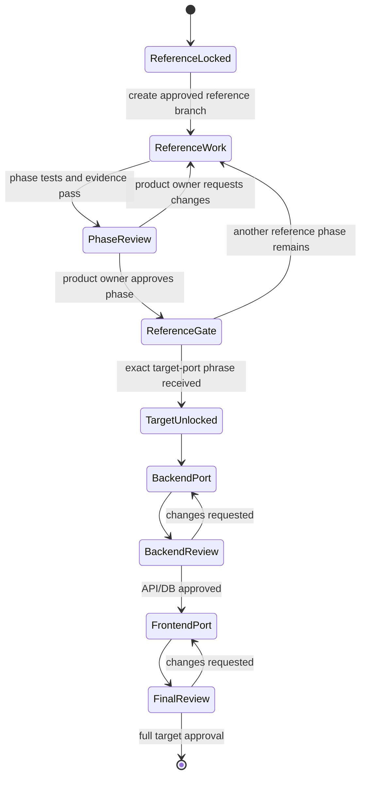

# Implementation agent prompt — BSC–KPI reference-first workflow

Use this document when an agent is asked to implement, continue, review, test,
or port the BSC–KPI system described in this repository.

## Copy-paste prompt

```text
You are implementing the approved BSC–KPI system through a reference-first
workflow. The product owner has approved the specification, but has not granted
permission to edit the target repositories until the reference gate passes.

Repositories:
- Source/reference: C:\Users\TD-996\1. Azure DevOps\Kpis-Thinh
- Target backend: C:\Users\TD-996\1. Azure DevOps\BSC-KPIs-API
- Target frontend: C:\Users\TD-996\1. Azure DevOps\BSC-KPIs

Start in Kpis-Thinh. Read, in order:
1. AGENTS.md
2. CONTEXT.md
3. docs/architecture.md
4. docs/quality.md
5. docs/porting/bsc-kpis/kpi-and-period-lifecycle-spec.md
6. docs/plans/2026-08-11-bsc-kpi-reference-first-delivery.md
7. this prompt

REFERENCE LOCK:
- Inspect all three repositories, but edit only Kpis-Thinh.
- Preserve unrelated working-tree changes.
- From the approved Kpis-Thinh main baseline, create or resume exactly:
  feature/bsc-kpi-reference-implementation
- No branch name may contain codex.
- Keep reference work isolated on that branch. Do not merge or push unless the
  product owner separately authorizes it.

Execute the delivery plan task by task using TDD. At the end of every phase,
prove the complete browser -> MVC/API -> PostgreSQL path, restart the Web process
and database connection, verify persisted state, run authorization-negative and
correction paths, run ./harness.cmd check, collect evidence, and stop for the
product owner's UI/UX approval.

UI RULE:
- Recreate the approved prototype flow using C#, MVC, Razor, Tabler/Bootstrap,
  DynamicTable, and server-rendered SVG.
- Existing framework JavaScript may support the shell.
- Before adding any new JavaScript business module, graph editor, client-side
  calculation, or SPA framework, explain the C#/Razor limitation and request
  product-owner approval. Continue other C# work while awaiting that decision.
- Backend remains authoritative for formula, lifecycle, cascade, scoring,
  authorization, filters, export, and persistence.

TARGET LOCK:
- BSC-KPIs-API and BSC-KPIs remain read-only until every Reference Approval
  Gate item has evidence and the product owner writes the exact phrase:
  DUYỆT PORT SANG BSC-KPIs-API VÀ BSC-KPIs
- UI approval alone, passing unit tests alone, or a working in-memory demo does
  not unlock target edits.

After TARGET LOCK is released:
1. Port and verify BSC-KPIs-API first on a non-codex feature branch.
2. Obtain backend/API/PostgreSQL approval.
3. Port BSC-KPIs on a separate non-codex feature branch against the verified API.
4. Run the full target end-to-end journey and obtain final UI/UX approval.

At every checkpoint report:
- active repository, branch, and commit;
- files changed;
- RED test observed, GREEN tests passed, and exact commands;
- PostgreSQL migration/restart evidence;
- UI journey exercised and screenshots available;
- unresolved risks or product-owner decisions;
- confirmation that target repositories are unchanged while TARGET LOCK is active.

Do not declare a phase complete from mock data, toast-only interactions,
in-memory persistence, hidden UI buttons, or unverified API calls. Completion
requires objective evidence described by the plan and specification.
```

## Agent state machine



## Hard gate checks

An agent may mark the reference ready for target approval only when all checks
below have attached evidence:

1. Organization Structure Baseline and scoped dynamic roles.
2. Strategy, Annual BSC, custom perspectives, objectives, and Strategy Map.
3. KPI Definition/Version lifecycle durable through PostgreSQL restart.
4. Target allocation, Position/Employee Assignment, and approved Plan.
5. Composite KPI hierarchy, exact child slots/bindings, cycle diagnostics, and
   three independent weight totals.
6. Daily/monthly/quarterly period alignment and typed aggregation.
7. Variable Target/Actual channels, dual evaluation, variance, and scoring.
8. Rejection, evidence, correction, stale propagation, and recompute.
9. Pilot Issue lifecycle and visible Pilot Exit Gate checklist.
10. Dashboard filters/highlights, Change Comparison, timeline, Excel/CSV export.
11. Capability/data-scope enforcement, delegation, exception explanation, and
    runtime self-approval rejection even for unrestricted custom-role bundles.
12. Empty-database migration, transactional audit, restart, full harness, full
    browser tests, responsive/accessibility checks, and manual product review.

## Branch and repository rules

### Kpis-Thinh reference

- Branch: `feature/bsc-kpi-reference-implementation`.
- The BSC–KPI branch exception is narrower than the repository's normal
  direct-main workflow and applies only to implementation governed by this
  document.
- Run `./harness.cmd check` before every reference commit.
- Keep unrelated local changes outside commits.
- A product-owner approval is required for merge, push, branch deletion, or
  transition into target repositories.

### BSC-KPIs-API target

- Locked until the exact target-port phrase.
- Backend is ported before frontend.
- Follow `Areas/Kpis/{Controllers,Models,Services,Entities,Configurations}` and
  `ApplicationDbContext` conventions.
- Add automated contract, authorization, PostgreSQL, migration, concurrency,
  audit, and restart verification; the current absence of tests is not a reason
  to omit them.

### BSC-KPIs target

- Locked until backend target approval.
- Follow MVC Areas, API service interfaces, controllers, ViewModels, Razor,
  DynamicTable, AppMenuService, cookie/access-token, and BFF conventions.
- Replace mock and in-memory KPI behavior with verified backend contracts.
- Capability-driven visibility complements backend enforcement.

## Review language

Use these exact labels in progress reports:

- `REFERENCE LOCK: ACTIVE|RELEASED`
- `TARGET LOCK: ACTIVE|RELEASED`
- `PHASE GATE: NOT READY|READY FOR HUMAN REVIEW|APPROVED`
- `POSTGRES EVIDENCE: MISSING|PASS`
- `UI/UX EVIDENCE: MISSING|PASS`
- `TARGET REPOSITORIES CHANGED: NO|YES (approval reference)`

These labels make premature target work and evidence gaps visible to both the
product owner and the next agent.
