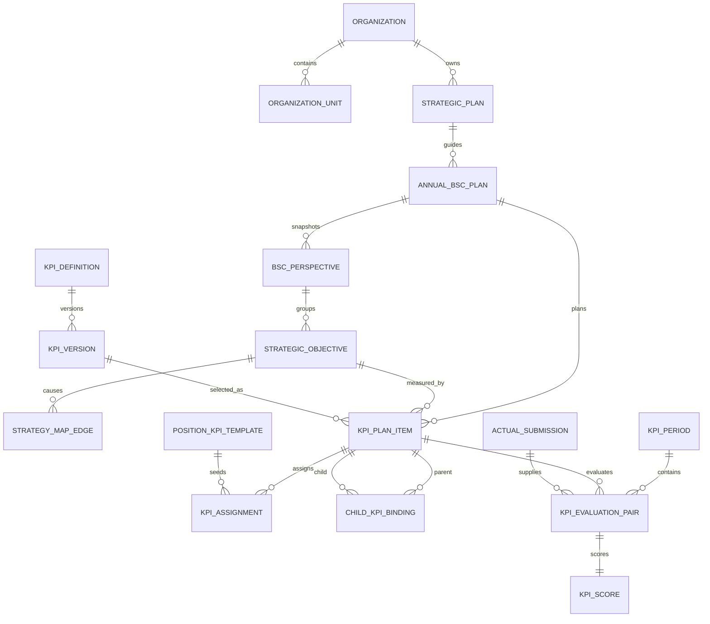
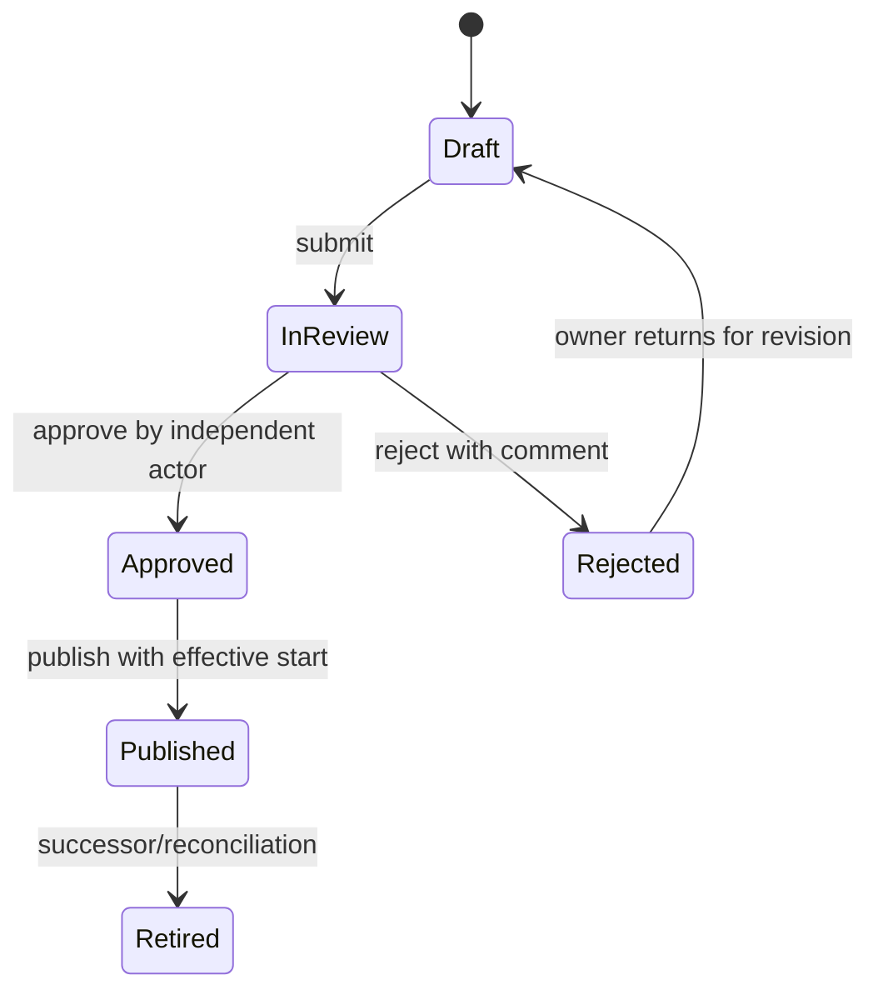
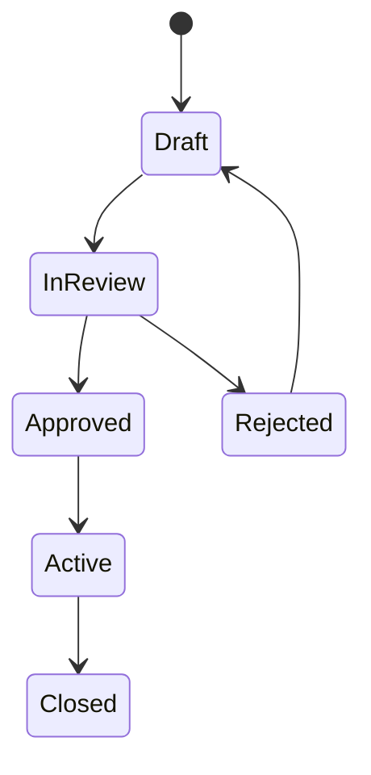
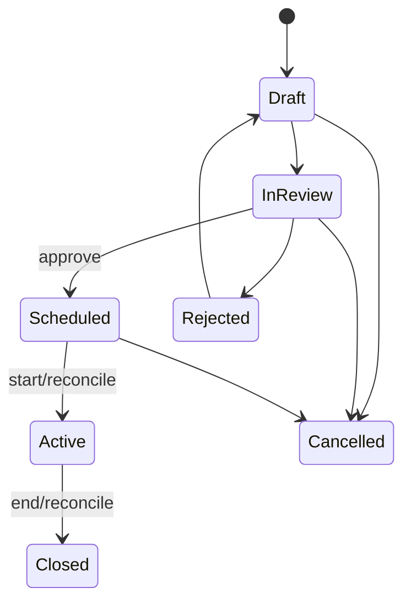
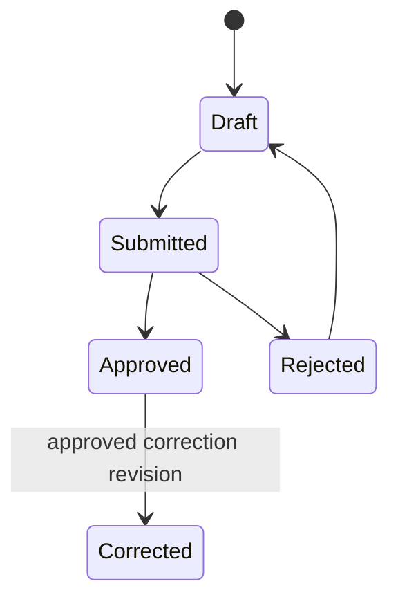

# BSC–KPI lifecycle and operating model specification

- Status: Approved shared understanding
- Approved by: Product owner in the `Kpis-Thinh` planning session
- Date: 2026-08-11
- Source repository: `Kpis-Thinh`
- Target backend: `BSC-KPIs-API`
- Target frontend: `BSC-KPIs`

## 1. Authority and project ownership

This document is the business and cross-project source of truth. When code,
mock UI, or an older plan conflicts with it, this document and `CONTEXT.md`
govern until the product owner approves a revision.

### Kpis-Thinh — Source

- Proves the reference domain, formula safety, lifecycle, persistence, API, and
  UI journey on an isolated feature branch.
- Supplies reusable logic and verified contracts; it is not the production
  deployment target.
- The existing implementation is a reference prototype, not proof that every
  KPI lifecycle transition is already durable in PostgreSQL. In particular,
  the reference implementation must prove submit, review, publication,
  retirement, correction, and restart persistence before target-port approval.

### BSC-KPIs-API — Owner

- Owns every business invariant, lifecycle transition, capability/data-scope
  check, formula evaluation, target allocation, cascade, score, audit record,
  PostgreSQL transaction, API contract, export contract, and recomputation.
- Uses the existing ASP.NET Core Area convention. BSC/KPI features live under
  `Areas/Kpis`; reporting read models may be delivered under `Areas/Reports`.
- Uses `ApplicationDbContext`, EF Core configurations, migrations, services,
  request contracts, response contracts, thin controllers, and access-token
  authentication already established by the repository.

### BSC-KPIs — Consumer

- Owns MVC/Razor UI composition, accessible interaction, localized labels,
  view models, API client services, filters, tables, diagrams, and user-facing
  validation summaries.
- Calls the backend through the existing MVC/BFF path:
  `Browser -> MVC Controller -> Backend API Service -> BSC-KPIs-API`.
- Treats backend responses as authoritative. Hidden buttons are usability, not
  authorization.
- Recreates the information architecture and visual flow of the local
  `BSC_KPI_UI_Prototype_Source 2` prototype using C#, Razor, Tabler/Bootstrap,
  and DynamicTable. New business JavaScript requires product-owner approval
  before implementation. Phase-one Strategy Map uses server-rendered SVG and
  form-based edge editing.

### Cross-project

- API contracts, stable error codes, capability names, lifecycle names,
  concurrency semantics, decimal serialization, pagination/filter contracts,
  correlation IDs, and version compatibility are shared contracts.
- A target feature is complete only when frontend, API, PostgreSQL, restart,
  authorization, rejection, correction, and audit evidence pass together.

## 2. Product boundary

The target architecture supports multiple Organizations, while the first
operational release exposes one Organization to simplify governance and
traceability. Every governed record remains Organization-scoped from day one.

The application covers the following operating chain:

1. Strategic Plan for three to five years.
2. Annual BSC Plan with four standard and optional custom perspectives.
3. Strategy Map of cause-and-effect relationships.
4. KPI Dictionary with stable definitions and governed versions.
5. Baseline, Target, Stretch Target, and period allocation.
6. Cascade through Organization -> Division -> Department -> Section.
7. Position KPI Templates and Employee KPI Assignments.
8. Formula, variable, source, cadence, owner, evidence, and data dictionary.
9. Scoring rules, thresholds, caps, rounding, and three independent weights.
10. One or two governed Pilot cycles with KPI Issues and a visible exit gate.
11. Official operation, review, dashboards, corrections, and exports.
12. KPI Score handoff only. The application does not calculate bonus, payroll,
    reward amount, or payout instruction.

## 3. Reference-first delivery rule

Production work is gated by a complete reference implementation.

1. An implementation agent creates
   `feature/bsc-kpi-reference-implementation` in `Kpis-Thinh` from the approved
   `main` baseline. The branch name must not contain `codex`.
2. All experimental domain, API, PostgreSQL, and UI work occurs only on that
   branch. The agent preserves unrelated user changes and does not merge the
   branch without explicit approval.
3. Until the Reference Approval Gate passes, the agent may inspect but must not
   edit `BSC-KPIs-API` or `BSC-KPIs`.
4. The product owner reviews the complete reference journey, including UI/UX,
   backend rules, API contracts, real PostgreSQL persistence, restart evidence,
   authorization, audit, correction, and end-to-end tests.
5. Target implementation begins only after the product owner explicitly says:
   `DUYỆT PORT SANG BSC-KPIs-API VÀ BSC-KPIs`.
6. After approval, backend contracts and persistence are implemented first in
   `BSC-KPIs-API`; `BSC-KPIs` then consumes those verified contracts. Target
   code must follow each target repository's existing Area/service conventions.

## 4. Canonical domain model

Canonical term definitions live in `CONTEXT.md`. The principal relationships
are:

### 4.1 Organization and identity

- `Organization` is the tenant and data-isolation boundary.
- `OrganizationUnit` is a generic effective-dated tree with a unit type, parent,
  status, and stable code; no schema depends on exactly four hierarchy levels.
- `ApplicationUser` and Employee use one persisted profile in the initial
  target, while `AccountStatus` and `EmploymentStatus` remain independent.
- An Employee may have multiple effective Position Assignments, with one primary
  Position and optional allocation metadata.
- Organization Structure Baseline approval snapshots units, positions,
  reporting lines, position holders, and scoped role assignments.
- KPI Dictionary authoring may proceed before that baseline. Annual planning,
  assignment, position templating, approval routing, and cascade cannot be
  submitted without an effective approved baseline.

### 4.2 Strategy and BSC

- Strategic Plan is a governed three-to-five-year plan.
- Annual BSC Plan is a separate yearly translation linked to one Strategic Plan.
- Every Organization starts with Financial, Customer, Internal Process, and
  Learning & Growth perspectives. Organization administrators may add custom
  perspectives with stable codes; used perspectives are deactivated, not
  deleted. Each Annual Plan snapshots its selected perspective catalog.
- Each KPI Plan Item measures exactly one Strategic Objective. One KPI Version
  may be reused by separate Plan Items for different objectives or scopes.
- Strategy Map is a directed acyclic graph of Strategic Objectives. Cross-
  perspective edges are allowed; cycles are rejected with the exact path.

### 4.3 KPI definition, version, and plan item

- KPI Definition is stable identity and Organization-scoped immutable code.
- KPI Version owns measurement meaning: name, description, cadence, formula or
  qualitative rubric, ordered variables/input slots, result type, change
  summary, predecessor, effective range, and lifecycle evidence.
- KPI Version never owns annual target, employee list, organization-specific
  weight, or scorecard placement.
- KPI Plan Item selects one exact KPI Version in an Annual BSC Plan, scope,
  objective, Target Set, Scoring Policy, measurement scope, approval policy,
  target allocation, and weights.
- KPI Assignment links a Plan Item to Accountable or Contributor Employees.
  Shared Organization/Unit measures use one result; Individual measures use an
  individual Plan Item/result rather than duplicating the KPI Version.
- Position KPI Template seeds Assignment proposals. Generated Assignments keep
  their template snapshot; template changes affect future plans or an approved
  amendment, never live history.

### 4.4 Composite KPI and organizational cascade

- Organizational position determines the normal cascade direction: a parent
  Plan Item belongs to a higher Organization scope and a child belongs to a
  descendant scope.
- Each child has one direct parent at the next selected cascade layer. Higher
  ancestors receive contribution through the chain. Skipping a hierarchy level
  requires reason and approval.
- The dependency graph is acyclic. Diagnostics identify the KPI, input slot,
  binding, cadence, and full failing dependency path.
- KPI Version declares symbolic child input slots. Annual Plan binds each slot
  to an exact child KPI Plan Item, KPI Version, and aligned Reporting Period.
- A child measurable input supplies its Target Evaluation to the parent target
  channel and Actual Evaluation to the parent actual channel.
- Binding weights belong to the Plan Revision and total exactly 100 percent for
  each parent. Formula literals are not the authority for contribution weights.
- Safe functions such as `SUM`, `WEIGHTED_SUM`, and `WEIGHTED_AVG` obtain
  governed weights from the exact binding snapshot.
- A missing required child blocks official parent evaluation unless an approved
  Score Completeness Exception creates a visibly provisional result.
- Child correction marks dependent parents stale and triggers idempotent,
  topologically ordered recomputation while preserving every prior revision.

### 4.5 Three independent weights

1. Cascade Contribution Weight: child contribution to one direct Composite KPI
   parent; active direct-child weights total 100 percent per parent.
2. Objective KPI Weight: Plan Item contribution to Strategic Objective Progress;
   active KPI weights total 100 percent per objective.
3. Scorecard KPI Weight: KPI Score contribution to Employee or Unit Official
   Aggregate Score; required scorecard weights total 100 percent.

These weights have separate fields, validations, APIs, audit events, revision
histories, and impact previews. They may have equal numeric values but are never
automatically synchronized. All use decimal arithmetic, never binary floating
point.

## 5. Lifecycles

### 5.1 KPI Version

- Draft content may be edited; submitted and historical content is immutable.
- Reviewer cannot edit submitted content or approve their own governed artifact.
- Publication and retirement must persist definition/version and audit evidence
  atomically. Restart must preserve every transition.

### 5.2 Strategic Plan and Annual BSC Plan

- Only one overlapping Active Annual BSC Plan exists per Organization/year.
- Approved or Active content changes through an audited amendment/effective
  revision. Carry-forward creates a new Draft with provenance and a diff; it
  never carries Actuals or Scores.

### 5.3 KPI Period

- Daily, monthly, quarterly, and annual cadence are supported.
- Daily cadence uses the Organization Business Calendar and selects CalendarDay
  or BusinessDay behavior.
- Higher-frequency child periods roll into lower-frequency parents through a
  declared Aggregation Policy: Sum, Weighted Average, Last, Minimum, Maximum,
  or constrained Formula. Calendar overlap alone never chooses an operation.
- Closed periods stay closed. Correction appends a superseding Evaluation and
  recomputes downstream state; it does not edit the historical row.

### 5.4 Actual Submission and official evaluation

- Manual entry and CSV are first adapters; API/ERP/HR adapters use the same
  Actual Submission contract later.
- Evidence Policy controls files, URLs, explanations, and mandatory comments.
- Every Formula Variable has Target and Actual channels plus a Variable Tracking
  Policy. Constant uses the same frozen value; Reference has planned/observed
  values; Derived is calculated separately; Manual/API/Import declare a source
  for each channel.
- The exact KPI Version is evaluated twice for each point: Target Evaluation
  from Target channels and Actual Evaluation from Actual channels.
- Missing required channels block official evaluation; no implicit zero exists.
- Correction creates new Actual, Evaluation, Score, variance, and downstream
  aggregate revisions. Current official and full history are both queryable.

### 5.5 Pilot and KPI Issue

- Pilot Mode uses the same API, database, workflows, and scoring as production,
  but official dashboards/exports exclude Pilot results by default.
- KPI Issue lifecycle is `Open -> InProgress -> Resolved -> Closed` and records
  severity, exact affected artifact, owner, root cause, corrective action, and
  evidence.
- Pilot Exit Gate appears as a UI checklist. Promotion remains disabled until
  Critical/High issues are resolved, formula/target/scoring are reconciled,
  full frontend/API/PostgreSQL/restart tests pass, authorization/rejection/
  correction tests pass, variance reports are approved, and required owners
  sign off.
- Promotion creates a separate Production Plan/Revision linked to the Pilot
  source. Pilot results are never relabeled as official results.

## 6. Target, variance, time series, and scoring

- Annual Target Set contains Baseline, Formula-derived Target, and Stretch.
- Target Allocation Policy distributes annual values to periods using Equal,
  Custom, or constrained Formula behavior appropriate to Additive, Average,
  End-of-period, or custom semantics.
- Mid-year target changes create an approved effective revision. Closed periods
  retain old targets; future periods use the new revision.
- KPI and every Formula Variable expose period and cumulative/YTD Target,
  Actual, absolute variance, relative variance, and revision history.
- KPI Change Comparison is one reusable page with From/To timestamps, daily
  grouping, current-versus-corrected toggle, and filters for Organization Unit,
  Position, Employee, KPI, variable, status, and change type.
- Configuration revisions/events are stored on change; official time-series
  points are stored by cadence. The system does not duplicate full unchanged
  configuration every calendar day.
- Scoring Policy maps Actual Result versus Target Set using direction, tolerance,
  thresholds, cap, weight, and rounding. Formula result and KPI Score are
  distinct.
- Performance Band, Attention Flag, Governance Status, and Data Status are
  independent filter dimensions.
- Missing required Scores block Official Aggregate Score. An approved exception
  records Provisional, ExcludeAndReweight, or TreatAsZero behavior and remains
  prominent in UI, timeline, and export.

## 7. Authorization and dynamic roles

Authorization is `Capability + Data Scope + resource facts`, never role-name
comparison.

### 7.1 Capability catalog

The backend publishes a fixed catalog grouped at least by:

- Organization: view/manage structure, positions, assignments, baseline.
- Strategy: create/edit/submit/review/activate/close plans and objectives.
- Strategy Map: view/manage edges.
- KPI Dictionary: create/edit/submit/review/publish/retire/clone/archive.
- Planning: create/edit/submit/review/activate/amend/carry-forward plans.
- Assignment/Cascade: manage position templates, assignments, bindings, weights.
- Actual/Evaluation: submit/review/correct actuals, evaluate, recompute.
- Scoring: manage policies, approve exceptions, publish aggregate scores.
- Pilot: manage issues, verify exit gates, promote configuration.
- Reports: view dashboard, compare changes, export.
- Security/Audit: manage roles, assign roles, approve privilege, delegate,
  audit-read.

### 7.2 Custom role

- System role templates are shared definitions; Custom Roles are Organization-
  scoped immutable capability bundles. A different bundle is a new role.
- Role editor permits any capability combination and displays toxic-combination
  warnings. Runtime invariants still reject self-approval and prohibited actions
  on the same artifact.
- Role Assignment supplies Employee, role, exact Data Scope, effective period,
  and Organization. Privileged self-elevation requires independent approval.
- System capability names are not user-created. UI menu/action visibility uses
  effective capabilities returned by the backend.

### 7.3 Data scope and approver resolution

- Supported scopes include Organization, UnitSubtree, Assigned, and Self.
- Approval stages resolve by Direct Manager, Organization Unit Head, Position
  holder, Named User/Group, or Capability + Data Scope.
- Resolution uses the approved Organization Structure Baseline and is snapshotted
  at submission. Configured fallback is visible; stages are never silently
  skipped.
- Delegation is effective-dated, scope-limited, audited, and cannot expand the
  delegate's capability/data scope or permit self-approval.
- Approval/exception timelines are visible to involved actors and actors with
  AuditRead in the applicable organization-tree scope. They explain selector,
  resolved approver, delegation, decision, reason, evidence, and score impact.

## 8. UI/UX contract

The local prototype is a visual and navigation reference, not a business or
persistence authority. Production preserves its major information architecture:

- Dashboard and period selector.
- Organization structure.
- Strategic Objectives and visual Strategy Map.
- KPI Dictionary and KPI Versions.
- Formula, variable Target/Actual, and Scoring Policy.
- KPI Plan, Position/Employee Assignment, and Cascade tree.
- Actual entry, evidence, evaluation, approval, and correction.
- Result, target/actual variance, score, status/flag filters, and export.
- Pilot Issues and visible Exit Gate checklist.
- Change Comparison and audit timeline.

Phase-one diagrams use Razor/C# and server-rendered SVG. A JavaScript business
module, client graph editor, or SPA framework is a separately approved change.
Bootstrap/Tabler's existing JavaScript remains infrastructure, not permission to
move domain calculations into the browser.

## 9. API and persistence invariants

- Every write uses an authenticated actor, Organization, capability, data scope,
  correlation ID, concurrency token, and stable error mapping.
- Controllers map transport only. Services/application operations own commands;
  domain objects own invariants; EF configurations own persistence mapping.
- Official state plus Audit Record commit atomically.
- Approved/submitted/evaluated facts are immutable; amendments and corrections
  append effective revisions.
- Decimal values serialize as invariant strings where precision is material.
- Composite evaluation stores formula/version, plan revision, child bindings,
  raw target/actual child results, weights, weighted contributions, and outcome.
- Recompute is idempotent and dependency ordered. Stale downstream state is
  visible and cannot be published as current official output.
- List endpoints use typed filter/sort contracts compatible with DynamicTable;
  arbitrary client-side business filtering is not authoritative.
- Export applies the same Data Scope and active filters as the query and includes
  status, flags, exception markers, revision identity, and audit metadata.

## 10. Release phases and completion gates

### Phase 0 — Foundation

Organization baseline, Employee/account status, Position, capability catalog,
Custom Role, scoped assignments, audit, concurrency, API error contract, tests.

### Phase 1 — Strategy and BSC

Strategic Plan, Annual BSC Plan, perspective catalog, Strategic Objective,
Strategy Map DAG, governance lifecycle, server-rendered visual map.

### Phase 2 — KPI design and planning

KPI Dictionary/Version, quantitative and qualitative models, formula catalog,
Target Set/allocation, Scoring Policy, Position templates, Plan Items,
Assignments, Composite bindings, three weights, plan approval/amendment.

### Phase 3 — Pilot and operation

Periods, Target/Actual pairs, evidence, dual evaluation, corrections, time
series, daily comparison, variance, scores, aggregates, dashboards, filters,
Pilot Issues, Exit Gate, production promotion, Excel/CSV export.

### Phase 4 — Score handoff

Filtered KPI Score export/API for an external HR/Payroll process. No reward or
payment calculation is introduced.

Every phase exits only after:

1. focused domain/application tests pass;
2. API contract and authorization-negative tests pass;
3. PostgreSQL migration and round-trip tests pass;
4. restart proves durable state;
5. MVC frontend completes the phase's happy path and rejection/correction path;
6. accessibility and responsive checks pass;
7. `./harness.cmd check` passes in `Kpis-Thinh` during reference work;
8. product owner approves the UI/UX evidence before the next phase.

## 11. Reference Approval Gate

Porting to target repositories remains locked until all boxes are evidenced:

- [ ] Organization -> Strategy -> BSC -> Objective -> Strategy Map journey.
- [ ] KPI Definition -> Version -> review -> publication persists across restart.
- [ ] Annual Plan -> Target -> Position/Employee Assignment -> approval.
- [ ] Composite KPI bindings validate hierarchy, cadence, cycles, and 100% weights.
- [ ] Target/Actual variable inputs -> dual evaluation -> variance -> Score.
- [ ] Daily/monthly/quarterly alignment and aggregation examples pass.
- [ ] Actual rejection, correction, stale propagation, and recompute pass.
- [ ] Dynamic role, data scope, delegation, and self-approval tests pass.
- [ ] Pilot Issue and visible Pilot Exit Gate journey pass.
- [ ] Dashboard filters, highlights, comparison, timeline, and exports pass.
- [ ] PostgreSQL migration, transaction, append-only audit, and restart pass.
- [ ] Full frontend end-to-end tests and manual UI/UX review pass.
- [ ] Product owner gives the exact target-port approval phrase.

Until then, `BSC-KPIs-API` and `BSC-KPIs` remain read-only reference inputs.
