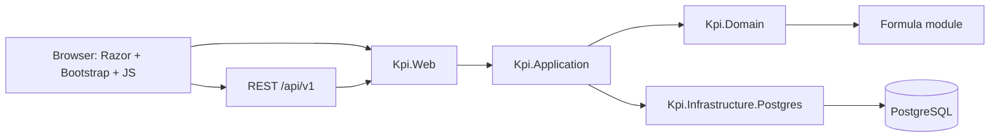
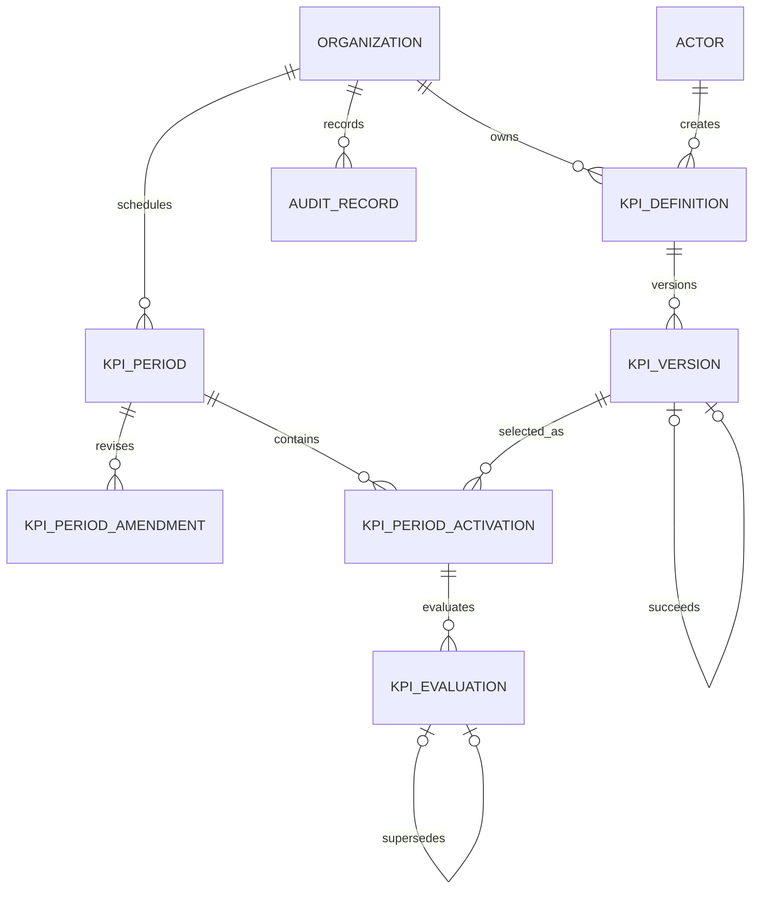

# KPI Management Feasibility Application Design

- Status: Proposed for written-spec review
- Date: 2026-08-09
- Domain glossary: [`CONTEXT.md`](../../../CONTEXT.md)
- Governing constitution: [`.specify/memory/constitution.md`](../../../.specify/memory/constitution.md)

## 1. Purpose

Build a locally runnable feasibility application that proves an extensible KPI management model can:

- create, read, update, archive, restore, and audit KPI definitions;
- preserve immutable, explainable KPI versions;
- author deterministic formulas with a dynamic number of typed variables;
- review, approve, publish, retire, and select KPI versions for governed periods;
- test draft formulas without persistence;
- persist official evaluations and reproduce their formula, inputs, outcome, and history exactly;
- expose the same behavior through a versioned JSON API and a Vietnamese-first web UI;
- move into a larger ASP.NET Core/PostgreSQL application without rewriting the domain and formula engine.

This is a working feasibility application, not throwaway prototype code. It must be tested, documented, and wired into the repository harness.

## 2. Scope

### 2.1 Included in the first release

1. KPI Definition CRUD, immutable KPI Code, controlled Draft deletion, archive, and restore.
2. KPI Version drafting, validation, review, approval, publication, and retirement.
3. Version history, predecessor links, mandatory change summaries, and human-readable diffs.
4. Dynamic Formula Variables with ordered definitions and manual evaluation inputs.
5. Formula tokenizer, Pratt parser, typed/versioned AST, validator, and deterministic evaluator.
6. Monthly, quarterly, and annual KPI periods using the company calendar and `Asia/Ho_Chi_Minh`.
7. Separate period planning and approval, explicit rejection recovery, scheduled activation, closure, cancellation, and Scheduled-only Amendment effective revisions.
8. Selection of one eligible KPI Version per KPI Definition in each period.
9. Transient Formula Test Runs and persisted official KPI Evaluations.
10. Immutable evaluation corrections with changed-input and changed-result diffs.
11. Append-only audit records for governed commands and transitions.
12. Development-only persona simulation for all required roles.
13. REST JSON endpoints under `/api/v1` and server-rendered `.cshtml` pages.
14. Vietnamese UI and error messages with English resources prepared from the start.
15. Automated unit, PostgreSQL integration, and minimal browser smoke tests.
16. A detailed human-and-agent integration guide produced with the completed application.

### 2.2 Explicitly excluded

- Production authentication, sessions, identity-provider integration, and deployment-grade identity/policy adapters. Domain/Application capability and separation-of-duty enforcement remains included.
- Employee assignment and employee-specific KPI tracking.
- Nested KPI references inside formulas.
- Data ingestion from Microsoft Graph, Excel, ERP, data warehouses, or external APIs.
- Email, Teams, Gmail, or other notification delivery.
- Dashboards, reports, charts, and management analytics.
- Drag-and-drop formula construction.
- Fiscal calendars other than the Gregorian calendar.
- Multi-organization administration in the UI.
- Production deployment configuration.
- Arbitrary code, recursion, loops, database access, or network access from formulas.

The model keeps an organization scope and provider-neutral seams so later work can add these capabilities without changing the formula core.

## 3. Considered approaches

### 3.1 Recommended: modular ASP.NET Core monolith

Use one deployable ASP.NET Core MVC application backed by PostgreSQL, with separate Domain, Application, Infrastructure, and Web projects. This matches the intended host application's C# and `.cshtml` stack while keeping the KPI logic portable.

Benefits:

- one local process and one database;
- public behavior remains behind focused module interfaces;
- formula and governance rules do not depend on ASP.NET or EF Core;
- straightforward migration into the larger modular application;
- simpler transactions for version, period, evaluation, and audit invariants.

Trade-off: all modules deploy together in the feasibility application.

### 3.2 Rejected: single MVC project with controllers calling EF Core directly

This would be faster to scaffold but would couple formula, governance, persistence, and UI behavior. Moving the feature into the larger project would require extracting the domain under pressure, and tests would depend on controller and database details.

### 3.3 Rejected: separate formula and KPI microservices

This would add independent deployment, authentication between services, distributed transactions, and operational complexity before any external consumer exists. The formula engine remains an independent module, not a separate process.

## 4. Technology decisions

- Runtime: supported .NET 10 LTS SDK, pinned with `global.json` after installation.
- Web: ASP.NET Core MVC with Razor Views (`.cshtml`).
- Styling: Bootstrap 5, compatible markup, and small vanilla JavaScript modules.
- Persistence: PostgreSQL 18.x through EF Core and Npgsql migrations.
- Formula numbers: `System.Decimal`, maximum precision 28 and scale 10.
- Serialization: `System.Text.Json` with explicit discriminators for AST nodes.
- Unit tests: xUnit.
- Integration tests: xUnit against the local PostgreSQL instance with isolated test data.
- Browser smoke tests: Playwright for .NET.
- Localization: ASP.NET Core localization with `.resx` resources; `vi-VN` default and `en-US` included for core text.

The repository currently has PostgreSQL 18.4 running locally but no .NET SDK or Docker. Implementation installs .NET 10, uses the existing PostgreSQL service, and does not require Docker.

## 5. Architecture



Dependency direction:

```text
Kpi.Web → Kpi.Application → Kpi.Domain
Kpi.Infrastructure.Postgres → Kpi.Application + Kpi.Domain
Kpi.Domain → no application framework or persistence package
```

### 5.1 Solution structure

```text
src/
  Kpi.Domain/
  Kpi.Application/
  Kpi.Infrastructure.Postgres/
  Kpi.Web/
tests/
  Kpi.Domain.Tests/
  Kpi.IntegrationTests/
  Kpi.Web.EndToEndTests/
```

### 5.2 Deep modules and seams

#### Formula module

The Formula module hides tokenization, precedence, type checking, AST schema, limits, evaluation, source spans, and structured failures behind two primary operations:

```csharp
FormulaCompilation Compile(
    string source,
    IReadOnlyList<FormulaVariableDefinition> variables,
    FormulaResultType expectedResultType);

EvaluationOutcome Evaluate(
    CompiledFormula formula,
    IReadOnlyDictionary<string, FormulaValue> inputs);
```

Callers never construct trusted AST nodes. `Compile` is the only trusted path from source to executable AST.

#### KPI governance module

Application commands express user intent such as create definition, create version, submit review, approve, publish, retire, archive, restore, and transfer ownership. Domain objects enforce transitions; controllers do not reimplement state rules.

KPI Creators own and edit their Draft content. KPI Policy Approvers decide without editing. KPI Administrators can monitor definitions, versions, periods, evaluations, and audit history but cannot modify creator-owned KPI content. Development personas supply simulated identities, while Application commands authoritatively enforce capabilities and separation of duty; only production identity integration is deferred.

#### Period governance module

Application commands prepare plans, select eligible versions, submit, approve/reject, return Rejected plans to Draft, reconcile scheduled time transitions, close, cancel, and propose/review Scheduled Amendments. Approved Amendments create immutable effective revisions used by activation. A supplied clock makes time behavior deterministic in tests.

#### Evaluation module

One operation accepts an activated KPI Version and input snapshot, evaluates it, and appends an immutable attempt. A separate correction command computes and stores differences while keeping the earlier attempt.

#### Persistence seam

The application depends on task-focused storage interfaces and a transaction interface. PostgreSQL adapters implement them. Interfaces expose domain-shaped operations rather than mirroring every EF Core method.

Provider interfaces for email, identity, external data, or cloud schedulers are not added until a corresponding feature has a real second adapter. The architecture requires future provider-specific SDKs to remain outside Domain and Application.

## 6. Domain model

Canonical definitions live in `CONTEXT.md`. The core relationships are:



### 6.1 KPI Definition

- UUID internal identity.
- Immutable organization-scoped KPI Code in canonical uppercase snake case.
- Current owner actor.
- Archive state and timestamps.
- Optimistic concurrency token.
- Definition identity remains stable across every version.

Deletion rules:

- a Definition whose only version is an unused Draft that has never been submitted may be hard-deleted;
- hard deletion removes its mutable content but appends an audit tombstone containing identity, actor, time, and reason;
- a Definition with any submitted, approved, published, retired, activated, or evaluated history can only be archived;
- restoring an Archived KPI Definition does not automatically publish or reactivate a version.

### 6.2 KPI Version

- UUID identity and monotonically increasing integer version number.
- Required Vietnamese-capable name and description.
- Required change summary and optional predecessor version.
- Ordered Formula Variable schema.
- Declared result type: Decimal or Boolean.
- Cadence: Monthly, Quarterly, or Annual.
- Formula representation and schema metadata.
- Effective date range.
- Lifecycle state and review/publication metadata.
- Optimistic concurrency token.

Version lifecycle:

```text
Draft → InReview → Approved → Published → Retired
           └──────→ Rejected → Draft
```

Only Draft content is editable. Approvers approve or reject with comments and never edit submitted content. Published content is immutable. Retired versions remain visible and cannot be selected for a new period.

Publication assigns `effective_from`. A Definition has at most one currently effective Published version. Publishing a successor closes the predecessor's effective range at the successor's `effective_from`; when that instant is reconciled, the predecessor becomes Retired and the successor becomes the current version. Effective ranges may not overlap, and reconciliation is idempotent and catches up after downtime.

An unused Draft version that has never been submitted or activated may be hard-deleted with an audit tombstone. Every other version remains as immutable history.

To reuse retired behavior, a creator clones the old version into a new Draft, supplies a change summary, and repeats approval.

### 6.3 Formula Variable

Each ordered variable contains:

- canonical case-insensitive `snake_case` code;
- localized display name and description;
- type Decimal or Boolean;
- required flag;
- optional non-null default value compatible with the type;
- display order.

Evaluation begins only when each required variable has an explicit or default value. Null is not a valid evaluation input.

### 6.4 KPI Period

- organization scope;
- human-readable code, name, and description;
- cadence;
- Gregorian start and end timestamps interpreted in `Asia/Ho_Chi_Minh`;
- planner and separate approver;
- selected exact KPI Version per KPI Definition;
- state, review comments, timestamps, and concurrency token.

Period lifecycle:

```text
Draft → InReview → Scheduled → Active → Closed
           │
           └→ Rejected → Draft

Draft/InReview/Scheduled → Cancelled
```

Rules:

- submitter cannot approve the same period;
- same-cadence periods cannot overlap;
- a version cadence must match its period cadence;
- one KPI Definition may appear only once in a period;
- the same KPI Definition cannot be active in overlapping periods in the first release;
- approval freezes dates and selections;
- rejection moves InReview to a read-only Rejected state; only the Planner may return it to Draft, while rejection evidence remains immutable;
- only Scheduled periods may be amended in the MVP;
- an approved Amendment records a complete immutable effective revision based on the latest approved revision, never overwrites the original plan, and is the revision used by later activation;
- Active, Closed, and Cancelled periods reject Amendment proposals;
- selected versions cannot be invalidated in a way that breaks a Scheduled or Active period;
- reaching the start time activates all selected versions atomically;
- reaching the end time closes the period;
- time reconciliation is idempotent and catches up after application downtime.

### 6.5 KPI Evaluation

An official evaluation belongs to one period activation and stores:

- exact KPI Version identity;
- ordered input snapshot after defaults;
- outcome: Success or Failure;
- successful Decimal or Boolean value, or structured failure details;
- evaluator actor and timestamp;
- predecessor evaluation when it is a correction;
- changed-input and result diff;
- mandatory correction reason;
- current/superseded state.

Every attempt is immutable. Only a successful attempt can become Current. A later Failure remains visible but does not replace the latest successful Current evaluation.

A Formula Test Run uses the same compiler and evaluator against a Draft but is never persisted.

### 6.6 Audit Record

Append-only audit records cover:

- definition creation and Draft edits;
- submit, approve, reject, publish, and retire;
- archive, restore, and ownership transfer;
- period creation, selection changes, submit, approve, reject, schedule, activation, closure, cancellation, and amendments;
- evaluation correction relationships.

Official evaluation attempts are stored as evaluation history and are not duplicated wholesale into the audit table. Audit records include organization, actor, event type, entity identity, timestamp, reason when required, correlation identity, and a concise JSON change summary.

## 7. Formula language

### 7.1 Syntax

Canonical example:

```text
IF(revenue > target AND active, ROUND(revenue / target * 100, 2), 0)
```

Supported constructs:

- literals: Decimal and Boolean;
- variables: case-insensitive canonical `snake_case` identifiers;
- grouping: parentheses;
- comparison: `=`, `!=`, `>`, `>=`, `<`, `<=`;
- logical: `AND`, `OR`, unary `NOT`;
- conditional: `IF(condition, when_true, when_false)`;
- arithmetic: `+`, `-`, `*`, `/`, unary `-`;
- postfix percentage: `25%` equals `0.25`;
- functions: `ROUND(value, scale)`, `ABS(value)`, and `MOD(value, divisor)`.

Keywords and functions are case-insensitive and remain English in every UI culture.

### 7.2 Precedence

Highest to lowest:

1. Parentheses and primary values.
2. Postfix percentage.
3. Unary `-` and `NOT`.
4. `*`, `/`.
5. `+`, `-`.
6. Comparisons.
7. `AND`.
8. `OR`.

### 7.3 Types and evaluation

- Arithmetic accepts Decimal values only.
- Logical operations accept Boolean values only.
- Comparisons require compatible operand types.
- `IF` condition is Boolean and both branches must resolve to the same declared type.
- `IF` evaluates only the selected branch.
- `AND` and `OR` short-circuit.
- Division by zero returns Failure.
- Missing variables, incompatible defaults, type mismatches, numeric overflow, invalid scale, syntax errors, and complexity-limit violations return stable failures.
- Evaluation never returns Null as a successful business value.

### 7.4 Decimal behavior

- Use `System.Decimal`.
- Maximum precision: 28 significant digits.
- Maximum stored/evaluated scale: 10 fractional digits.
- PostgreSQL queryable Decimal values use `numeric(28,10)` where a relational numeric column is appropriate.
- `ROUND` uses midpoint rounding away from zero (business half-up behavior).
- JSON transmits Decimal literals, defaults, inputs, and results as invariant-culture strings.

### 7.5 Safety limits

- maximum 100 Formula Variables;
- maximum source length 10,000 characters;
- maximum AST depth 32;
- maximum 10,000 evaluated nodes per run;
- maximum evaluation duration 500 milliseconds;
- no loops, recursion, custom code, reflection, file access, process access, network access, or database access.

### 7.6 Formula representation

The `formula` PostgreSQL `jsonb` value contains exactly two business fields:

```json
{
  "source": "IF(revenue > target, revenue / target * 100, 0)",
  "ast": {
    "nodeType": "If",
    "resultType": "Decimal",
    "span": { "start": 0, "length": 54 },
    "condition": {},
    "whenTrue": {},
    "whenFalse": {}
  }
}
```

`formula_language_version`, `ast_schema_version`, and checksum are separate KPI Version columns. Source text is returned exactly as authored. The ordered variable schema is stored separately as a JSON array.

The AST is a versioned public read contract. It is never trusted as a write contract.

## 8. API design

All JSON endpoints live under `/api/v1`. Browser pages are not the API contract.

### 8.1 Formula endpoints

- `POST /api/v1/formulas/validate`: compile source and return typed AST or ProblemDetails.
- `POST /api/v1/formulas/test`: compile and evaluate a non-persisted Draft test input.

Requests provide source, variables, expected result type, and optional test inputs. Requests cannot submit trusted AST. Responses return:

```json
{
  "formula": {
    "source": "ROUND(revenue / target * 100, 2)",
    "ast": { "nodeType": "Call", "resultType": "Decimal" }
  },
  "formulaLanguageVersion": 1,
  "astSchemaVersion": 1
}
```

### 8.2 KPI endpoints

- definitions: list, get, create, update metadata, delete eligible unused Draft, archive, restore, transfer ownership;
- versions: list, get, create Draft, update Draft, delete eligible unused Draft, clone, submit, approve, reject, publish, retire, diff;
- every mutation accepts the current concurrency token.

### 8.3 Period endpoints

- list and retrieve periods;
- create and update Draft plan;
- add, change, and remove version selections;
- submit, approve, reject, cancel, amend;
- read resolved activations and current state.

### 8.4 Evaluation endpoints

- create official evaluation for an Active period activation;
- list immutable attempts;
- read Current evaluation;
- create a correction that supersedes an earlier successful evaluation.

Correction response example:

```json
{
  "supersedesEvaluationId": "019...",
  "reason": "Nhập sai doanh thu",
  "changedInputs": [
    {
      "variable": "revenue",
      "oldValue": { "type": "Decimal", "value": "100" },
      "newValue": { "type": "Decimal", "value": "120" }
    }
  ],
  "oldResult": { "type": "Decimal", "value": "25" },
  "newResult": { "type": "Decimal", "value": "30" }
}
```

### 8.5 Audit endpoints

- filter by entity, actor, event type, and date range;
- return append-only ordered records;
- do not expose credentials or sensitive configuration values.

### 8.6 Errors

Use RFC-compatible ProblemDetails with stable English error codes and localized messages. Formula diagnostics include source start and length. Validation failures use HTTP 422, concurrency conflicts use 409, forbidden lifecycle transitions use 409, missing resources use 404, and malformed requests use 400.

Example:

```json
{
  "type": "formula-validation-error",
  "title": "Công thức không hợp lệ",
  "status": 422,
  "errors": [
    {
      "code": "FORMULA_DIVISION_BY_ZERO",
      "message": "Không thể chia cho 0.",
      "start": 18,
      "length": 6
    }
  ]
}
```

### 8.7 Decimal JSON

Decimal values are typed strings to avoid JavaScript precision loss:

```json
{ "type": "Decimal", "value": "25.1234567890" }
```

Boolean values use native JSON booleans with an explicit type when carried by the polymorphic FormulaValue contract.

## 9. Persistence design

### 9.1 Relational tables

- `organizations`
- `actors`
- `kpi_definitions`
- `kpi_versions`
- `kpi_periods`
- `kpi_period_activations`
- `kpi_evaluations`
- `audit_records`

Queryable identity, status, ownership, version number, cadence, dates, current pointers, and concurrency fields remain relational.

### 9.2 JSONB values

- formula object containing source and AST;
- ordered Formula Variable schema;
- evaluation input snapshot;
- Evaluation Failure details;
- correction diff;
- concise audit change summary.

### 9.3 Critical constraints

- unique `(organization_id, kpi_code)`;
- unique `(kpi_definition_id, version_number)`;
- unique `(kpi_period_id, kpi_definition_id)` activation;
- at most one Current successful evaluation per activation;
- append-only audit table permissions;
- foreign keys preserve version, activation, evaluation, and predecessor history;
- optimistic concurrency token on editable definitions, Draft versions, and Draft period plans.
- non-overlapping effective ranges for Published versions of the same KPI Definition, enforced transactionally together with successor publication.

Cross-row period overlap and state-transition rules are enforced transactionally in Application/Domain and covered by PostgreSQL integration tests.

## 10. Web UI

### 10.1 Shared layout

- Bootstrap 5 responsive layout.
- Vietnamese default culture.
- Development-only persona switcher in the navigation bar.
- Status badges, lifecycle actions, confirmation dialogs, and accessible form labels.
- Production startup refuses configuration that enables persona simulation.

### 10.2 KPI list and detail

- search by code/name;
- filter by state, owner, and cadence;
- display current published version and archive state;
- open version timeline, diff, audit, archive, restore, and ownership transfer actions.

### 10.3 KPI Draft editor

Three primary regions:

1. Ordered Formula Variable list with Add Variable card/modal.
2. Formula source editor with autocomplete and insert-at-cursor actions.
3. Syntax/function reference, validation output, and AST preview.

The Add Variable form includes code, display name, type, required flag, default, description, and order. Test inputs are separate from variable definitions.

Validation is debounced through the server. Diagnostics highlight the exact source span and suggest the valid syntax. The reference shows operators, signatures, descriptions, and examples. Test Run results are displayed and discarded.

### 10.4 Review and publication

- submitted versions are read-only;
- approver can approve or reject with comment;
- approved version can be published with effective date;
- version timeline shows predecessor and change summary;
- diff compares name, description, variable schema, and source formula.

### 10.5 Period planning

- define name, cadence, start, and end;
- select eligible KPI Versions from newest to oldest;
- show ineligible versions disabled with reason;
- prevent duplicate definitions, mismatched cadence, and overlaps;
- submit and approve using separate personas;
- display Scheduled, Active, Closed, Cancelled, and amendment history.

### 10.6 Evaluation

- available only for Active activations;
- render one typed input per Formula Variable;
- show defaults and descriptions;
- display Success or localized Failure details;
- show Current result and attempt history;
- correction form requires reason and displays old/new input and result diff.

### 10.7 Audit

- timeline with actor, action, entity, time, reason, and change summary;
- filters for entity, actor, event type, and date;
- links back to the affected definition, version, period, or evaluation.

## 11. Persona simulation

Development seed data includes:

- Nguyễn An — KPI Creator;
- Trần Bình — KPI Policy Approver;
- Lê Chi — KPI Period Planner;
- Phạm Dũng — KPI Period Approver;
- Hoàng Giang — KPI Evaluator;
- Đỗ Hà — KPI Administrator.

Seed a `REVENUE_ACHIEVEMENT` KPI and related variables to make the full workflow demonstrable. Persona identity is carried only by a Development implementation and is never treated as production authentication.

## 12. Time reconciliation

An ASP.NET Core hosted worker invokes an idempotent Application command on an interval. The same reconciliation runs once during startup. It atomically:

- activates Scheduled periods whose start time has arrived;
- closes Active periods whose end time has passed;
- appends exactly one audit record per actual transition;
- catches up correctly after downtime.

Domain/Application accept an injected clock. A future external cloud scheduler calls the same command rather than duplicating transition logic.

## 13. Concurrency and security boundaries

- Editable resources use optimistic concurrency tokens.
- Stale commands fail with 409 and never overwrite newer content.
- Formula source is untrusted input and can only execute through the constrained compiler/evaluator.
- AST from clients is ignored or rejected as a write authority.
- Formula resource limits apply before and during evaluation.
- SQL is parameterized through EF Core/Npgsql.
- Credentials use user-secrets or environment variables and are never committed.
- Persona simulation is Development-only and guarded at startup.
- Audit rows are append-only through application behavior and database permissions.

## 14. Localization

- Default request/UI culture: `vi-VN`.
- Secondary culture included from the first release: `en-US`.
- User-facing text and diagnostics come from `.resx` resources.
- Domain failures expose stable English codes plus localization arguments, not hard-coded sentences.
- Formula keywords, KPI Code, variable codes, and API property names remain English/canonical.

## 15. Verification strategy

### 15.1 TDD discipline

Every behavior slice begins with a failing test, verifies the intended failure, adds minimal implementation, verifies green, and refactors while green.

### 15.2 Unit tests

- tokenizer tokens and source spans;
- precedence and associativity;
- every operator/function and type rule;
- short-circuit behavior;
- precision, scale, percentage, MOD, ABS, and midpoint-away-from-zero ROUND;
- every structured failure;
- complexity limits;
- lifecycle transitions and forbidden transitions;
- version/period eligibility and overlap rules;
- evaluation correction diffs and Current selection.

### 15.3 Serialization golden tests

- source text round-trips exactly;
- ordered variables remain ordered;
- each AST node has stable versioned JSON;
- Decimal strings preserve exact values;
- formula JSONB reload reproduces the same source, AST meaning, inputs, and outcome.

### 15.4 PostgreSQL integration tests

- migrations apply from an empty database;
- relational and JSONB mappings round-trip;
- immutable history and foreign keys remain intact;
- unique and concurrency constraints reject invalid writes;
- restart/reload reproduces prior formulas and evaluations;
- audit rows cannot be mutated through supported persistence operations.

### 15.5 Browser smoke test

Automate one principal flow:

1. select Creator persona;
2. create definition and Draft version;
3. add variables and validate/test formula;
4. submit and approve/publish with the appropriate persona;
5. create and submit a period, reject it as a separate Approver, return it to Draft as its Planner, revise/resubmit, and approve it;
6. approve a Scheduled Amendment and verify the original plan plus immutable effective revision;
7. activate the period through controlled time/reconciliation using the latest approved revision;
8. evaluate with manual inputs;
9. reload and confirm formula, AST, result, revision, and history;
10. correct an input and inspect the diff;
11. inspect audit, archive, and restore behavior.

### 15.6 Harness

`.harness/harness.json` becomes the only source of bootstrap, format, build/static, unit, integration, and browser test commands. Recurring bootstrap performs locked restore, provisions the pinned Playwright browser when absent, validates required non-secret local/test configuration, and safely applies the declared local/test migration manifest. `./harness.cmd check` is the Windows definition of done and CI executes the equivalent PowerShell entrypoint.

## 16. Local environment and database

- Install the supported .NET 10 SDK and pin it with `global.json`.
- Use the existing PostgreSQL 18 service.
- Provision a dedicated `kpi_lab` database and least-privilege user without writing credentials to the repository.
- Use .NET user-secrets for interactive local configuration and environment variables for automated runs.
- Bootstrap restores locked tools/packages, provisions the declared browser runtime, validates required local configuration, and applies documented safe local/test migrations; it never invents or stores a password.
- Local UI runs on an explicitly documented localhost URL.

## 17. Future extension seams

The first release does not implement these features, but its model must allow them:

- organization-aware uniqueness expands from the seeded single organization to multi-tenant administration;
- employee assignment references stable KPI Definition plus selected version/period activation;
- nested KPI formulas add a versioned KPI-reference AST node with cycle detection;
- external inputs enter through provider adapters and become explicit Evaluation Input snapshots;
- identity uses OIDC/OAuth adapters such as Microsoft Entra ID;
- notifications use a provider interface with Microsoft 365, Gmail, or SMTP adapters;
- time reconciliation can be invoked by AWS or Azure schedulers;
- dashboards and reports read immutable Current evaluations and history rather than recalculating mutable definitions.

## 18. Required integration guide

The completed feature includes a Vietnamese guide written for both a human and another coding agent. It must contain:

1. prerequisites and exact environment checks;
2. .NET SDK and PostgreSQL setup;
3. solution/module responsibilities and dependency direction;
4. package and pinned version inventory;
5. database schema, migrations, and safe credential configuration;
6. harness, localhost, test, and troubleshooting commands;
7. REST endpoint examples and formula/AST JSON examples;
8. the workflow for definitions, versions, reviews, periods, evaluations, corrections, and audit;
9. a file-by-file extraction map for importing the feature into the larger project;
10. replacement seams for authorization, identity, providers, scheduler, and external data;
11. a checklist that removes persona simulation before production;
12. prompts and context pointers another AI can use to continue the work safely.

## 19. Acceptance criteria

The first release is accepted only when all statements below are demonstrably true:

1. A user can perform the included workflow through the local Bootstrap 5 web UI.
2. Formula variables can be added dynamically and remain ordered after database reload.
3. The approved language parses, validates, type-checks, and evaluates deterministically without arbitrary execution.
4. Source, typed AST, version metadata, inputs, successful result or failure, and audit history round-trip through PostgreSQL without semantic change.
5. Draft Test Runs do not create database rows.
6. Published KPI Versions and approved periods enforce every lifecycle and separation-of-duty rule; each Definition has at most one currently effective Published version, and a due successor retires its predecessor.
7. A period activates and closes at the correct configured time, including catch-up after downtime.
8. Official evaluations are immutable; corrections preserve both attempts, changed fields, result delta, and reason.
9. A failed later attempt does not replace the latest successful Current result.
10. The REST API returns the documented versioned formula object and Decimal string contract.
11. Vietnamese UI works and core English localization resources exist.
12. Persona simulation cannot run outside Development.
13. Eligible unused Drafts can be hard-deleted with an audit tombstone; historical content can only be archived and restored.
14. Unit, integration, serialization, and browser smoke tests run through the harness.
15. `./harness.cmd check` succeeds with application lint/static/build/test steps configured.
16. The integration guide enables a human or another AI to run, understand, and extract the feature.

## 20. Delivery and Git

Implementation work remains directly on `main`. No local or remote-tracking branch may contain `codex`; the repository harness enforces both rules. Before delivery:

- preserve unrelated existing workspace changes;
- review the complete diff against this spec and repository standards;
- run the full harness with fresh evidence;
- commit only intended files with configured author identity;
- fetch and verify that `origin/main` has no commits absent locally, then push `main` to the configured Git remote;
- report any missing remote, credentials, or authorization instead of inventing them.
