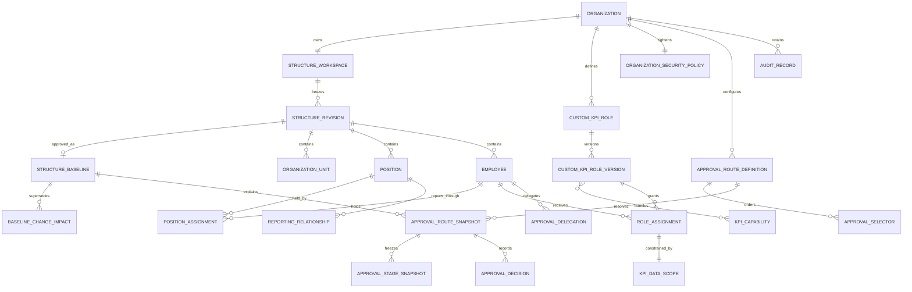
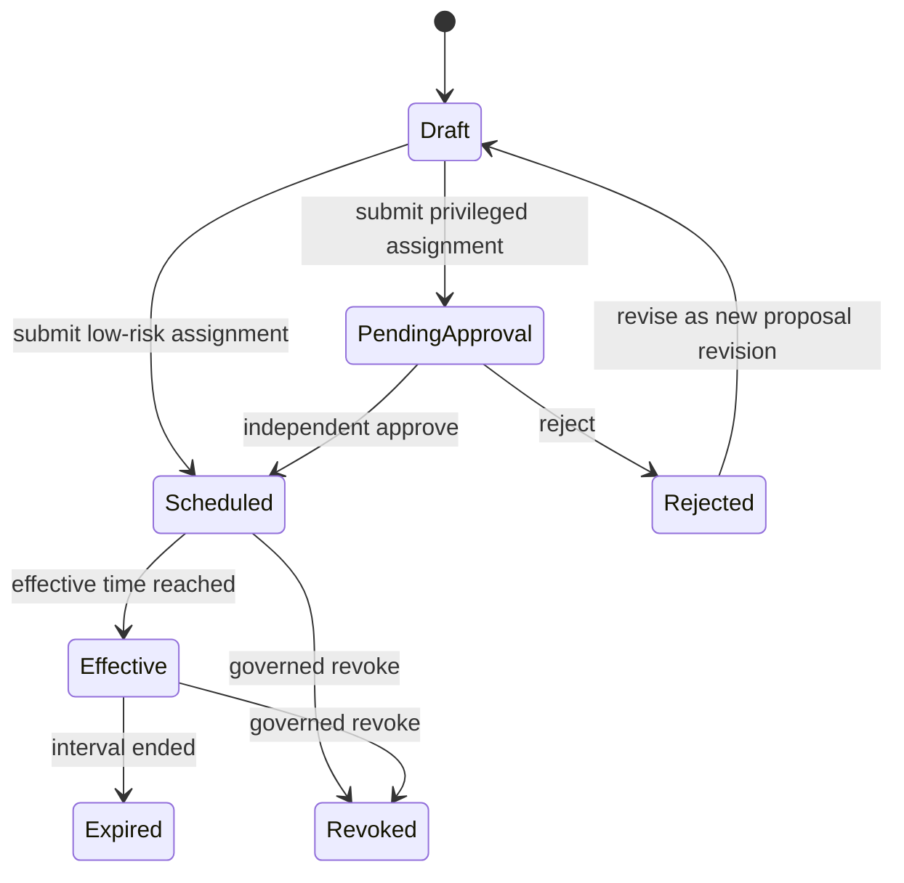

# Phase 1 Data Model: Organization and Authorization Foundation

## Modeling conventions

- Every row and domain identity is explicitly scoped by `OrganizationId`, even
  when the first release exposes only one Organization.
- Effective intervals are half-open: `[EffectiveFrom, EffectiveTo)`. A null end
  means infinity. Instants are stored in UTC; Organization timezone controls
  entry and display.
- Mutable heads carry both a business `Revision` and PostgreSQL `xmin`.
- Submitted revisions, approved baselines, role versions, route snapshots,
  decisions, impact facts, and Audit Records are immutable.
- Status strings and capability identifiers are stable machine codes; localized
  labels belong to Web resources.
- Deletion of governed history is not part of any persistence interface.

## Relationship overview

The entities inside one `StructureRevision` are immutable snapshot members.
The diagram shows logical relationships; snapshot member tables include the
revision/baseline identity in their keys so facts from different revisions do
not alias one another.

## Shared value objects

### EffectiveInterval

| Field | Type | Rule |
|---|---|---|
| `From` | `DateTimeOffset` | Required UTC instant. |
| `To` | `DateTimeOffset?` | Null means infinity; otherwise strictly greater than `From`. |

Operations: `Contains(instant)`, `Overlaps(other)`, `Intersect(other)`, and
`SplitAt(instant)`. Domain operations are exact; presentation converts through
`Organization.TimeZoneId`.

### RevisionToken

| Field | Type | Rule |
|---|---|---|
| `Revision` | `long` | Increases by one for every accepted mutable-head change. |
| `RowVersion` | `uint/string` | PostgreSQL `xmin`, serialized as an opaque HTTP ETag/concurrency token. |

### StableCode

Trimmed, normalized for comparison, and unique inside its declared Organization
scope. Display names are not stable identities.

## Organization and workforce

### Organization

Aggregate root and data-isolation boundary.

| Field | Type | Rule |
|---|---|---|
| `Id` | `Guid` | Immutable. |
| `Code` | `string` | Unique product-wide administrative code. |
| `Name` | `string` | Required display name. |
| `TimeZoneId` | `string` | Required valid Organization timezone. |
| `Status` | `Active/Inactive` | Inactive Organizations cannot receive new governed changes. |
| `OperationallyExposed` | `bool` | Exactly one true in the first release; not an isolation shortcut. |

### OrganizationStructureWorkspace

The single editable head for one Organization. Saving a change validates local
shape and increments `Revision`; it does not create an approved fact.

| Field | Type | Rule |
|---|---|---|
| `Id`, `OrganizationId` | `Guid` | One workspace per Organization. |
| `Revision` | `long` | Optimistic business revision. |
| `UpdatedBy`, `UpdatedAt` | actor/time | Last accepted edit evidence. |
| `RowVersion` | concurrency token | Rejects stale writes. |
| `Document` | structure document | Units, Positions, Employees, assignments, reporting links, and baseline-linked scoped role assignment references. |

### OrganizationStructureRevision

Immutable reviewed candidate produced when the workspace is submitted.

| Field | Type | Rule |
|---|---|---|
| `Id`, `OrganizationId` | `Guid` | Immutable identity and scope. |
| `RevisionNumber` | `long` | Matches the submitted workspace revision. |
| `Status` | `Submitted/Approved/Rejected/Superseded` | Only submitted revisions may be reviewed. |
| `SubmittedBy`, `SubmittedAt`, `SubmissionReason` | evidence | Reason required. |
| `ReviewedBy`, `ReviewedAt`, `ReviewReason` | evidence? | Reviewer differs from submitter; reason required for approve/reject. |
| `ContentHash` | SHA-256 string | Detects snapshot drift. |
| `Snapshot` | immutable document | Exact reviewed graph and references. |

Validation freezes all errors before `Submitted`: duplicate/colliding stable
codes, missing parents, cycle path, incomplete reporting relationships,
conflicting Position Assignment intervals, zero/multiple primary Positions,
invalid allocation, unknown scoped assignment references, and missing required
approver configuration.

### OrganizationUnit snapshot member

| Field | Type | Rule |
|---|---|---|
| `Id`, `OrganizationId`, `StructureRevisionId` | `Guid` | Same logical `Id` may appear in multiple immutable revisions. |
| `Code`, `Name`, `UnitType` | string | Code unique per Organization revision; type uses an Organization-governed catalog. |
| `ParentUnitId` | `Guid?` | Null only for roots; must reference same revision. |
| `Status` | `Active/Inactive` | Inactive nodes remain historical. |
| `EffectiveInterval` | interval | Must fit the revision/baseline applicability. |
| `Path` | ordered IDs/codes | Derived and persisted in baseline projection for subtree queries and diagnostics. |

An Organization may have multiple roots only when policy explicitly permits it;
the first-release policy requires one root.

### Position snapshot member

| Field | Type | Rule |
|---|---|---|
| `Id`, `OrganizationId`, `StructureRevisionId` | `Guid` | Immutable within a revision. |
| `Code`, `Name` | string | Code unique per Organization revision. |
| `OrganizationUnitId` | `Guid` | Required active unit in the same revision. |
| `Status` | `Active/Inactive` | Inactive Position receives no new assignment. |
| `EffectiveInterval` | interval | Required. |

### Employee snapshot member

| Field | Type | Rule |
|---|---|---|
| `Id`, `OrganizationId`, `EmployeeNumber` | identity | Employee number unique inside Organization. |
| `DisplayName` | string | Required. |
| `EmploymentStatus` | `Pending/Active/Leave/Ended` | Independent from sign-in account. |
| `EmploymentInterval` | interval | Required. |
| `AccountSubjectId` | `string?` | External sign-in identity link; not the Employee identity. |
| `AccountStatus` | `Unlinked/Enabled/Disabled` | Disabled blocks interactive action without ending employment. |

### PositionAssignment snapshot member

| Field | Type | Rule |
|---|---|---|
| `Id`, `OrganizationId`, `StructureRevisionId` | `Guid` | Stable assignment identity supports deterministic tie breaks. |
| `EmployeeId`, `PositionId` | `Guid` | Must exist in the same revision. |
| `EffectiveInterval` | interval | Intersection must be non-empty with Employee and Position intervals. |
| `IsPrimary` | `bool` | Exactly one applicable primary Position for every required active instant. |
| `AllocationPercent` | decimal | `> 0` and `<= 100`; applicable allocation totals follow Organization policy. |

Multiple Positions are allowed. Overlap is rejected only when it creates more
than one applicable primary Position or violates allocation/completeness rules.

### ReportingRelationship snapshot member

| Field | Type | Rule |
|---|---|---|
| `Id`, `OrganizationId`, `StructureRevisionId` | `Guid` | Immutable. |
| `SubordinatePositionId`, `ManagerPositionId` | `Guid` | Distinct and present in same revision. |
| `RelationshipType` | `Direct/SolidLine/DottedLine` | Direct-manager selectors use only `Direct`. |
| `EffectiveInterval` | interval | Required and compatible with both Positions. |

Direct relationships must be acyclic and must resolve required direct managers
or an explicit root exception.

### OrganizationStructureBaseline

Immutable approved effective snapshot used by planning, routing, and scope.

| Field | Type | Rule |
|---|---|---|
| `Id`, `OrganizationId` | `Guid` | Immutable. |
| `StructureRevisionId` | `Guid` | Exact approved revision. |
| `EffectiveFrom` | instant | First applicability instant; strictly later than the current chain tail start. |
| `ApprovedBy`, `ApprovedAt`, `ApprovalReason` | evidence | Copied from review decision. |
| `PreviousBaselineId` | `Guid?` | Required when superseding an earlier baseline. |
| `ContentHash` | string | Must equal approved revision hash. |

The approved baseline content and `EffectiveFrom` are immutable. Applicability
is represented by a separate `BaselineApplicabilitySegment` so later successor
approval can close the current open segment without mutating reviewed content.

### BaselineApplicabilitySegment

| Field | Type | Rule |
|---|---|---|
| `Id`, `OrganizationId`, `BaselineId` | `Guid` | Exactly one segment per approved baseline. |
| `EffectiveInterval` | interval | First segment may start in the future; the chain has no gaps after that start. |
| `ClosedBySuccessorBaselineId` | `Guid?` | Null only for the open chain tail. |
| `ClosedAt` | instant? | Equals the successor `EffectiveFrom`; set once in the successor approval transaction. |

The first approved baseline opens `[EffectiveFrom, infinity)`. Every successor
approval locks the Organization baseline-chain owner row, requires a start
strictly after the current tail start, closes the tail at exactly the successor
start, and inserts the successor `[start, infinity)` segment in the same
transaction. No command can close a segment without inserting its successor.
The database exclusion constraint prevents overlap; serialized row locking,
predecessor identity, and atomic close-plus-insert prevent gaps and concurrent
branching. Before the first segment starts, baseline-dependent operations return
`baseline_missing`; from that instant onward exactly one segment contains every
operating instant.

State is `Scheduled` before `EffectiveFrom`, `Effective` while the segment
contains now, and `Superseded` after its successor starts. These labels are
derived and never rewrite historical baseline content.

### BaselineChangeImpact

Immutable bridge to later KPI Planning/Evaluation features.

| Field | Type | Rule |
|---|---|---|
| `Id`, `OrganizationId` | `Guid` | Immutable. |
| `PreviousBaselineId`, `NewBaselineId` | `Guid` | Required for mid-period replacement. |
| `EffectiveAt` | instant | Equals new baseline start. |
| `ChangedUnitIds`, `ChangedPositionIds`, `ChangedEmployeeIds`, `ChangedAssignmentIds` | ordered ID sets | Server-derived diff. |
| `RequiresRecascade` | `bool` | True when responsibility/routing inputs changed during an open period. |
| `ImpactStatus` | `Detected/Acknowledged/Resolved` | Later Planning owns resolution reference; foundation never silently marks resolved. |
| `ResolvedByArtifactType/Id/Revision` | optional reference | Filled only by a governed downstream amendment. |

## Authorization

### KpiCapabilityDefinition

Fixed product catalog entry; not Organization-created.

| Field | Type | Rule |
|---|---|---|
| `Id` | stable dotted string | Immutable authorization unit. |
| `BusinessArea` | string code | Used to group the role-authoring UI. |
| `DisplayNameKey`, `DescriptionKey` | localization keys | No authorization meaning. |
| `Risk` | `Low/Medium/High/Critical` | Product minimum classification. |
| `AllowedScopeKinds` | set | Subset of Organization/UnitSubtree/Assigned/Self. |
| `ConflictsWith` | capability ID set | Produces warning only; runtime separation of duty still enforces prohibitions. |

Initial catalog groups business tasks for organization structure, baselines,
security roles, role assignments, delegation, approval, and audit viewing. New
codes require product code plus tests; removing a used code is prohibited.

### CustomKpiRole

Stable Organization-owned display identity.

| Field | Type | Rule |
|---|---|---|
| `Id`, `OrganizationId` | `Guid` | Immutable identity/scope. |
| `Name`, `Description` | string | Name unique among active roles in Organization. |
| `Status` | `Active/Retired` | Retired roles cannot create new assignments. |
| `LatestVersion` | integer | Informational head only. |
| `RowVersion` | concurrency token | Protects display metadata/head changes. |

### CustomKpiRoleVersion

Immutable capability bundle.

| Field | Type | Rule |
|---|---|---|
| `Id`, `RoleId`, `OrganizationId` | `Guid` | Exact version identity. |
| `VersionNumber` | integer | Monotonic per role. |
| `CapabilityIds` | ordered unique set | All codes must exist in fixed catalog. |
| `Warnings` | immutable warning snapshot | Risk/conflict warnings acknowledged at creation. |
| `CreatedBy`, `CreatedAt`, `ChangeReason` | evidence | Reason required for later versions. |

Creating a new version requires the role head's opaque concurrency token and
the exact base version. Two editors starting from the same head cannot create
implicit branches: the first commit advances `LatestVersion` and `RowVersion`;
the second receives `role.version.stale-head` with the current head and HTTP
409. Creating or viewing a role/version never creates a Role Assignment.

### KpiDataScope

Discriminated value object:

| Kind | Required target | Meaning |
|---|---|---|
| `Organization` | Organization ID | All resources in one Organization. |
| `UnitSubtree` | Baseline ID + Organization Unit ID | Unit and descendants in the applicable approved baseline. |
| `Assigned` | Business responsibility type + subject ID | Only resources explicitly assigned to the Employee. |
| `Self` | Employee ID | Only resources representing the Employee. |

Scope comparisons are explicit set-containment rules. A delegation uses the
intersection of original and delegated scopes; no string-prefix comparison is
authoritative.

### SystemSecurityFloor

Versioned product configuration containing minimum independent-approval rules:
minimum risk requiring approval, maximum safe scope kind, capabilities always
requiring approval, and separation-of-duty prohibitions. It is read-only to
Organization administrators.

### OrganizationSecurityPolicy

| Field | Type | Rule |
|---|---|---|
| `OrganizationId` | `Guid` | One current policy per Organization. |
| `Revision` | `long` | Optimistic revision. |
| `ApprovalRiskThreshold` | risk | Must be equal or stricter than system floor. |
| `MaximumSafeScope` | scope rank | Must be equal or narrower than system floor. |
| `AlwaysApproveCapabilityIds` | set | May add, never remove system requirements. |
| `ChangedBy`, `ChangedAt`, `Reason` | evidence | Audited. |

### RoleAssignment

Governed grant of one exact role version to one Employee.

| Field | Type | Rule |
|---|---|---|
| `Id`, `OrganizationId` | `Guid` | Immutable identity/scope. |
| `EmployeeId`, `RoleVersionId` | `Guid` | Same Organization. |
| `DataScope` | `KpiDataScope` | Compatible with every selected capability. |
| `EffectiveInterval` | interval | Authority exists only inside interval. |
| `Status` | lifecycle below | Proposed assignments grant nothing. |
| `RequiresIndependentApproval` | `bool` | Derived from effective security policy. |
| `RequestedBy/At`, `RequestReason` | evidence | Required. |
| `ApprovedBy/At`, `ApprovalReason` | evidence? | Independent actor when required. |
| `Revision`, `RowVersion` | concurrency | Protects proposed mutable head only. |

Lifecycle:

Approval/rejection facts are append-only. Revisions after rejection create a
new proposal revision and do not alter the rejected decision.

### AuthorizationResource

Application-only value describing the resource under decision:
`OrganizationId`, resource type/ID/revision, baseline ID, Organization Unit path,
business responsibility subjects, owner/submitter/beneficiary IDs, and effective
instant. Commands load this before authorization.

### AuthorizationDecision

| Field | Type | Rule |
|---|---|---|
| `Outcome` | `Allow/Deny` | No unknown/implicit allow state. |
| `ReasonCode` | stable code | `allowed`, `account_disabled`, `employment_inactive`, `missing_capability`, `scope_mismatch`, `authority_not_effective`, `separation_of_duty`, `baseline_missing`, or `approver_unresolved`. |
| `CapabilityId` | string | Requested atomic task. |
| `AssignmentIds` | ordered IDs | Effective grants considered. |
| `ScopeEvidence` | safe summary | Enough for authorized correction without protected leakage. |
| `RepresentedAuthorityId`, `DelegationId` | optional IDs | Present for delegated decisions. |

Every governed command consumes this result. Web may query a reduced decision
projection to show actions but must call the command again to enforce it.

## Approval and delegation

### ApprovalRouteDefinition

Stable Organization-scoped route identity for one governed artifact type. Its
mutable head has `LatestVersion`, `Status`, and `RowVersion`. Each
`ApprovalRouteVersion` contains ordered stages with one primary selector, zero
or more explicit fallbacks, required capability, required scope relation, and
decision policy. Used versions are immutable; changes require the route-head
concurrency token and create a new version. Stale heads return HTTP 409 rather
than branching.

Lifecycle: a new route begins `Draft`; successful validation permits
`Active`; a replacement version becomes the active version atomically; `Retired`
prevents new route snapshots while preserving historical ones. Only one active
route version may exist for an Organization and governed artifact type.

### ApprovalRouteVersion

| Field | Type | Rule |
|---|---|---|
| `Id`, `RouteDefinitionId`, `OrganizationId` | `Guid` | Exact immutable version identity. |
| `VersionNumber` | integer | Monotonic per route; unique with route ID. |
| `ArtifactType` | stable string | Matches the route definition. |
| `Stages` | ordered stage set | At least one; stage order is contiguous and unique. |
| `Status` | `Draft/Active/Retired` | Only validated versions become active. |
| `CreatedBy/At`, `ChangeReason` | evidence | Required. |

### ApprovalSelector

Discriminated selector kinds:

- `DirectManager`
- `OrganizationUnitHead`
- `PositionHolder`
- `NamedEmployee`
- `NamedGroup`
- `CapabilityWithinScope`

Each selector defines the source subject and the applicable approved baseline.
Resolution returns either an ordered eligible candidate set plus evidence or a
stable failure path. It never silently skips a stage.

### ApprovalRouteSnapshot

| Field | Type | Rule |
|---|---|---|
| `Id`, `OrganizationId` | `Guid` | Immutable. |
| `ArtifactType/Id/Revision` | reference | Exact submitted artifact. |
| `RouteDefinitionId/Version` | reference | Exact configured route. |
| `BaselineId` | `Guid` | Applicable approved structure used to resolve. |
| `SubmittedBy/At` | evidence | Required. |
| `Stages` | ordered snapshots | Selector, candidates, resolved actor, fallback, scope, and evidence. |
| `Status` | `Pending/Approved/Rejected/Blocked` | Derived from immutable decisions. |

### ApprovalDelegation

| Field | Type | Rule |
|---|---|---|
| `Id`, `OrganizationId` | `Guid` | Immutable governed identity. |
| `OriginalAuthorityEmployeeId`, `DelegateEmployeeId` | `Guid` | Distinct, active Employees. |
| `ResponsibilityTypes` | set | Exact approval duties only. |
| `DataScope` | scope | Cannot exceed original authority. |
| `EffectiveInterval` | interval | Required. |
| `Status` | `Draft/PendingApproval/Scheduled/Effective/Expired/Revoked/Rejected` | Independent approval when privilege policy requires it. |
| request/review evidence | actor/time/reason | Both identities preserved. |

### ApprovalDecision

Immutable decision at one route stage. Contains route/stage, decision
Approve/Reject, original authority, acting Employee, optional delegation,
authorization decision evidence, reason, time, correlation ID, and resulting
route status. The submitter, beneficiary, or same-artifact maker cannot approve.

## Deterministic mid-period contracts

### WeightAllocationInput

- Ordered existing assignments: stable assignment ID + exact prior decimal
  weight.
- Ordered new assignments: stable assignment ID + fixed exact decimal weight.
- Precision: integer decimal places allowed by policy.

Preconditions: every weight is positive, existing total is positive, new total
`N` is `> 0` and `< 100`, IDs are unique, and precision is within the product
limit.

### WeightAllocationPreview

For each existing assignment:

`raw = prior * (100 - N) / sum(prior)`

1. Floor `raw` to the configured precision.
2. Compute residual units between 100 and the floored existing plus fixed new
   totals.
3. Sort existing entries by descending fractional remainder, then prior order,
   then stable assignment ID.
4. Add one smallest unit to entries in that order until the residual is zero.
5. Verify existing relative weight order did not reverse and total equals
   exactly 100. If the precision cannot satisfy both invariants, reject with the
   exact conflicting assignments rather than changing order silently.

Output contains raw/floored/final values, residual recipients, precision,
formula version, and a proof total. For 50/20/30 plus fixed new 20, output is
40/16/24/20.

### EffectiveSegmentContract

Future Planning/Evaluation integration key:

| Field | Meaning |
|---|---|
| `PeriodId`, `SegmentId` | Exact reporting period and immutable segment. |
| `EffectiveInterval` | Non-overlapping slice inside the period. |
| `BaselineId` | Structure applicable to the segment. |
| `PlanRevisionId` | Governed plan revision after re-cascade. |
| `AssignmentWeightSnapshotId` | Exact weights for target/actual responsibility. |
| `AggregationPolicyId/Version` | Only policy allowed to combine segment outcomes. |

This feature defines and tests the contract but does not create official KPI
results.

## AuditRecord extension

The existing Audit Record grows without losing current fields:

| New field | Purpose |
|---|---|
| `RepresentedAuthorityActorId` | Original authority in delegated action. |
| `ResourceRevision` | Exact governed revision. |
| `CapabilityId` | Atomic business task requested. |
| `Decision` | Accepted/Rejected/Denied. |
| `ReasonCode` | Stable machine explanation. |
| `ScopeSnapshotJson` | Safe immutable scope evidence. |
| `AuthorizationEvidenceJson` | Assignment/delegation/selector IDs considered. |

Existing KPI audit writers may omit new nullable fields. New organization and
authorization commands must populate them.

## Relational persistence map

| Aggregate/fact | Main tables | Protection |
|---|---|---|
| Organization/workspace | `organizations`, `organization_structure_workspaces` | unique Organization code; `xmin` on workspace |
| Submitted revision | `organization_structure_revisions`, revision member tables | append-only after submission; content hash |
| Baseline | `organization_structure_baselines`, `baseline_applicability_segments`, baseline member projections | immutable reviewed content; unique chain links/open tail; GiST exclusion on Organization + applicability range |
| Custom role | `custom_kpi_roles`, `custom_kpi_role_versions`, `custom_kpi_role_capabilities` | unique role/version; immutable used version |
| Policy | `organization_security_policies` | one current head per Organization; revision + `xmin` |
| Role Assignment | `role_assignments`, `role_assignment_decisions` | exact role version; range indexes; proposal concurrency |
| Approval | `approval_route_definitions`, `approval_route_versions`, `approval_route_snapshots`, `approval_stage_snapshots`, `approval_decisions` | `xmin` on route head; immutable used version/snapshot/decision |
| Delegation | `approval_delegations`, `approval_delegation_decisions` | effective range indexes; non-expansion checked Domain/Application |
| Mid-period impact | `baseline_change_impacts` | immutable baseline pair + effective time |
| Audit | extended `audit_records` | update/delete rejected by database trigger |

Every foreign key that crosses an Organization-owned table includes or is
validated against the same `OrganizationId`; the Application adapter treats an
Organization mismatch as not-found/denied rather than loading cross-scope data.

## Required indexes and query paths

- Unique Organization Unit code per Organization + revision.
- Unique Position code and Employee number per Organization + revision.
- GiST effective-range lookup for baselines, assignments, delegations, and
  Position Assignments.
- Unique open baseline applicability tail per Organization, unique predecessor/
  successor links, and a named GiST exclusion constraint on Organization plus
  applicability range.
- Baseline unit path index for ancestor/subtree checks.
- Effective Role Assignment lookup by Organization + Employee + status/range.
- Route queue lookup by Organization + resolved actor + pending stage.
- Audit timeline lookup by Organization + resource + occurred time and by actor.
- Unique `(RoleId, VersionNumber)` and `(OrganizationId, normalized RoleName)`.

## Transaction boundaries

One Application command and its Audit Record commit in one unit of work.
Baseline approval takes a row lock on the Organization baseline-chain owner and
atomically commits the approved baseline projection, closes the predecessor
applicability segment at the exact successor start, opens the successor segment,
and writes `BaselineChangeImpact`. Role/version and route/version creation lock
their optimistic heads and reject stale tokens. Role Assignment approval commits
its decision and scheduled/effective grant. Approval decisions commit the
decision plus route status. A concurrency or database-constraint failure writes
no partial state and maps to stable HTTP 409 Problem Details.
