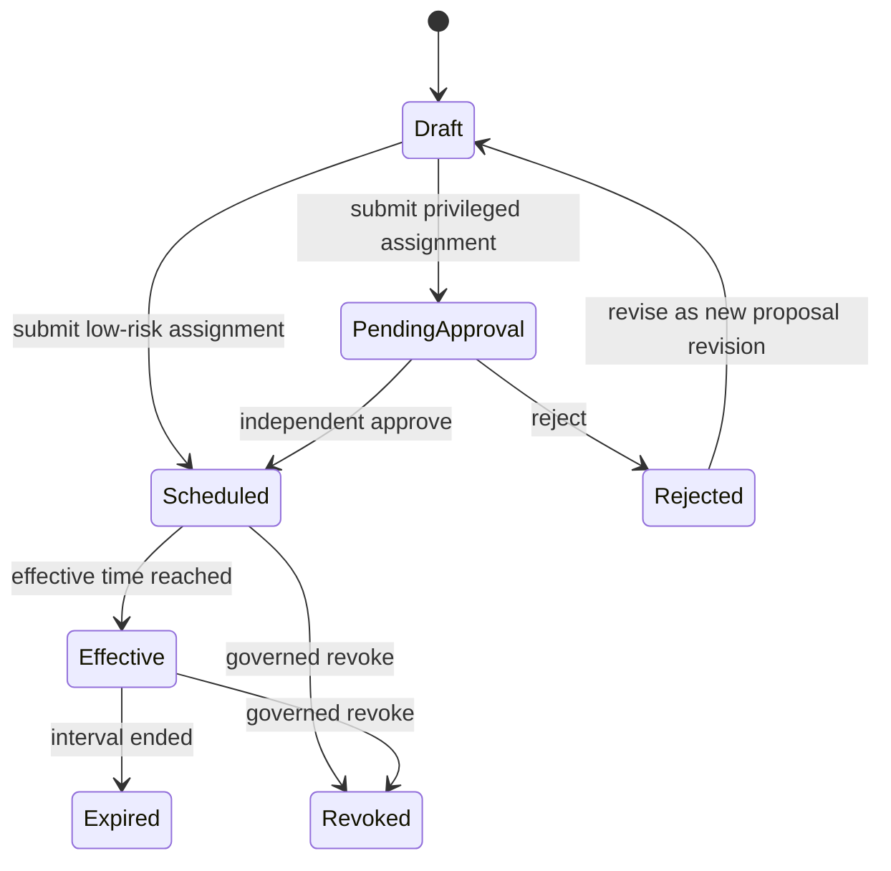
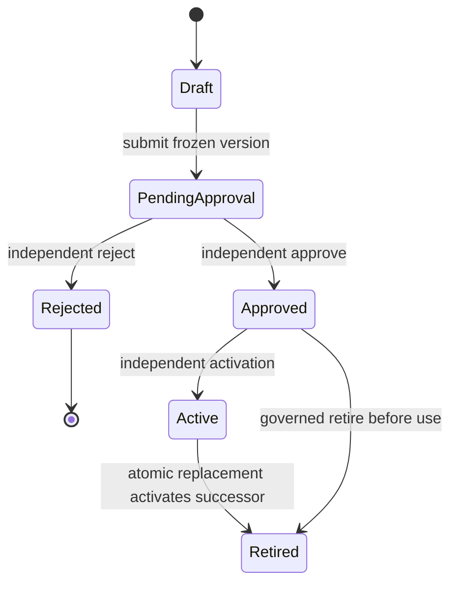

# Phase 1 Data Model: Organization and Authorization Foundation

## Modeling conventions

- Every row and domain identity is explicitly scoped by `OrganizationId`, even
  when the first release exposes only one Organization.
- Effective intervals are half-open: `[EffectiveFrom, EffectiveTo)`. A null end
  means infinity. Instants are stored in UTC; Organization timezone controls
  entry and display.
- Mutable heads carry both a business `Revision` and PostgreSQL `xmin`.
- Bootstrap provisioning/handoff/recovery evidence, submitted revisions,
  approved baselines, role versions, route snapshots, decisions,
  impact/resolution facts, and Audit Records are immutable.
- Status strings and capability identifiers are stable machine codes; localized
  labels belong to Web resources.
- Deletion of governed history is not part of any persistence interface.

## Relationship overview

```mermaid
erDiagram
    ORGANIZATION ||--|| STRUCTURE_WORKSPACE : owns
    ORGANIZATION ||--o{ BOOTSTRAP_PRINCIPAL : temporarily_authorizes
    ORGANIZATION ||--o{ BOOTSTRAP_RECOVERY_REQUEST : governs_recovery
    BOOTSTRAP_RECOVERY_REQUEST ||--o{ BOOTSTRAP_RECOVERY_DECISION : requires
    ORGANIZATION ||--o| BOOTSTRAP_AUTHORITY_HANDOFF : completes
    STRUCTURE_WORKSPACE ||--o{ STRUCTURE_REVISION : freezes
    STRUCTURE_REVISION ||--o| STRUCTURE_BASELINE : approved_as
    STRUCTURE_REVISION ||--o{ ORGANIZATION_UNIT : contains
    STRUCTURE_REVISION ||--o{ POSITION : contains
    STRUCTURE_REVISION ||--o{ EMPLOYEE : contains
    POSITION ||--o{ POSITION_ASSIGNMENT : held_by
    EMPLOYEE ||--o{ POSITION_ASSIGNMENT : holds
    POSITION ||--o{ REPORTING_RELATIONSHIP : reports_through
    STRUCTURE_BASELINE ||--o{ BASELINE_CHANGE_IMPACT : supersedes
    BASELINE_CHANGE_IMPACT ||--o| BASELINE_IMPACT_RESOLUTION : resolved_by

    ORGANIZATION ||--o{ CUSTOM_KPI_ROLE : defines
    CUSTOM_KPI_ROLE ||--o{ CUSTOM_KPI_ROLE_VERSION : versions
    CUSTOM_KPI_ROLE_VERSION }o--o{ KPI_CAPABILITY : bundles
    EMPLOYEE ||--o{ ROLE_ASSIGNMENT : receives
    CUSTOM_KPI_ROLE_VERSION ||--o{ ROLE_ASSIGNMENT : grants
    ROLE_ASSIGNMENT ||--|| KPI_DATA_SCOPE : constrained_by
    ORGANIZATION ||--|| ORGANIZATION_SECURITY_POLICY : tightens

    ORGANIZATION ||--o{ APPROVAL_ROUTE_DEFINITION : configures
    ORGANIZATION ||--o{ APPROVAL_GROUP : owns
    APPROVAL_GROUP ||--o{ APPROVAL_GROUP_MEMBERSHIP : contains
    EMPLOYEE ||--o{ APPROVAL_GROUP_MEMBERSHIP : joins
    APPROVAL_ROUTE_DEFINITION ||--o{ APPROVAL_SELECTOR : orders
    APPROVAL_ROUTE_DEFINITION ||--o{ APPROVAL_ROUTE_VERSION_REVIEW : governs
    ORGANIZATION ||--o{ APPROVAL_ROUTE_ACTIVATION_SLOT : routes
    APPROVAL_ROUTE_ACTIVATION_SLOT ||--o| APPROVAL_ROUTE_DEFINITION : activates
    APPROVAL_ROUTE_DEFINITION ||--o{ APPROVAL_ROUTE_SNAPSHOT : resolves
    STRUCTURE_BASELINE ||--o{ APPROVAL_ROUTE_SNAPSHOT : explains
    APPROVAL_ROUTE_SNAPSHOT ||--o{ APPROVAL_STAGE_SNAPSHOT : freezes
    EMPLOYEE ||--o{ APPROVAL_DELEGATION : delegates
    APPROVAL_ROUTE_SNAPSHOT ||--o{ APPROVAL_DECISION : records
    ORGANIZATION ||--o{ AUDIT_RECORD : retains
```

The entities inside one `StructureRevision` are immutable snapshot members.
The diagram shows logical relationships; snapshot member tables include the
revision/baseline identity in their keys so facts from different revisions do
not alias one another.

## Shared value objects

### EffectiveInterval

| Field | Type | Rule |
|---|---|---|
| `From` | `DateTimeOffset` | Required UTC instant. |
| `To` | `DateTimeOffset?` | Null means infinity; otherwise strictly greater than `From`. |

Operations: `Contains(instant)`, `Overlaps(other)`, `Intersect(other)`, and
`SplitAt(instant)`. Domain operations are exact; presentation converts through
`Organization.TimeZoneId`.

### RevisionToken

| Field | Type | Rule |
|---|---|---|
| `Revision` | `long` | Increases by one for every accepted mutable-head change. |
| `RowVersion` | `uint/string` | PostgreSQL `xmin`, serialized as an opaque HTTP ETag/concurrency token. |

### StableCode

Trimmed, normalized for comparison, and unique inside its declared Organization
scope. Display names are not stable identities.

## Organization and workforce

### Organization

Aggregate root and data-isolation boundary.

| Field | Type | Rule |
|---|---|---|
| `Id` | `Guid` | Immutable. |
| `Code` | `string` | Unique product-wide administrative code. |
| `Name` | `string` | Required display name. |
| `TimeZoneId` | `string` | Required valid Organization timezone. |
| `Status` | `Active/Inactive` | Inactive Organizations cannot receive new governed changes. |
| `OperationallyExposed` | `bool` | Exactly one true in the first release; not an isolation shortcut. |

Organization provisioning is one transaction: create the Organization, its
empty structure workspace, security-policy head, baseline-chain owner, and
exactly two active `BootstrapPrincipal` rows. It fails rather than leaving a
partially provisioned Organization.

### BootstrapPrincipal

Temporary Organization-scoped authority used only to cross the first-baseline
bootstrap boundary. It is an opaque external subject binding, not an Employee,
Custom KPI Role, Role Assignment, or delegable approval authority.

| Field | Type | Rule |
|---|---|---|
| `Id`, `OrganizationId` | `Guid` | Immutable identity/scope. |
| `Duty` | `Setup/IndependentApproval` | Exactly one active principal of each duty before handoff. |
| `SubjectId` | opaque string | Required; the two active duties must bind distinct subjects. |
| `GrantProfileVersion` | stable string | Product-fixed capability allowlist; Organization administrators cannot edit it. |
| `Status` | `Active/Replaced/Expired` | Replaced means break-glass substitution; Expired means governed handoff completed. |
| `ProvisionedBySubjectId`, `ProvisionedAt` | platform evidence | Required and immutable. |
| `ReplacedByPrincipalId`, `ReplacementRoleAssignmentId`, `ExpiredAt` | optional references/time | Set once by the governing recovery or handoff transaction. |

Bootstrap grants are non-delegable, subject to the same maker/approver
separation rules as ordinary authority, and valid only for the fixed first-
baseline and initial-security capabilities. They never authorize KPI planning,
actuals, evaluation, or platform recovery.

### BootstrapRecoveryRequest and decision

Break-glass replacement of one unavailable Bootstrap Principal. Platform
Security Administrator identity and authority are supplied by the host/platform
boundary; these administrators are not modeled as Organization Employees or KPI
Roles.

| Field | Type | Rule |
|---|---|---|
| `Id`, `OrganizationId`, `UnavailablePrincipalId` | `Guid` | The principal must still be active. |
| `ReplacementSubjectId` | opaque string | Differs from the unavailable and remaining active principal. |
| `Reason`, `RequestedBySubjectId`, `RequestedAt` | evidence | Required and immutable. |
| `ExpiresAt` | instant | Required, time-bounded, and later than request time. |
| `Status` | `Pending/Rejected/Expired/Applied` | Derived from immutable decisions and application fact. |
| `AppliedPrincipalId`, `AppliedAt` | optional reference/time | Present only after atomic replacement. |

Each `BootstrapRecoveryDecision` records request ID, platform administrator
subject, `Approve/Reject`, reason, time, and correlation ID. Application requires
two approvals from distinct Platform Security Administrators; neither may equal
either Bootstrap Principal. A rejection, expiry, duplicate administrator, stale
principal, or partial approval changes no principal. The second valid approval
atomically marks only the unavailable principal `Replaced`, inserts its active
replacement with the same duty/grant profile, and writes audit evidence.

### BootstrapAuthorityHandoff

Immutable proof that ordinary governed authorization replaced bootstrap access.

| Field | Type | Rule |
|---|---|---|
| `Id`, `OrganizationId` | `Guid` | At most one handoff per Organization. |
| `SetupReplacementRoleAssignmentId`, `ApprovalReplacementRoleAssignmentId` | `Guid` | Distinct effective approved Role Assignments that together cover the fixed replacement-duty requirements. |
| `CompletedAt`, `CompletedByCommandId`, `ContentHash` | evidence | Required and immutable. |

Role Assignment approval/effectiveness invokes the handoff evaluator in the
same transaction. Until both replacement duties are effective, both active
Bootstrap Principals remain active. When both exist, the handoff fact is inserted
and all active bootstrap principals expire atomically; there is no manual expiry
endpoint and no partial handoff.

### OrganizationStructureWorkspace

The single editable head for one Organization. Saving a change validates local
shape and increments `Revision`; it does not create an approved fact.

| Field | Type | Rule |
|---|---|---|
| `Id`, `OrganizationId` | `Guid` | One workspace per Organization. |
| `Revision` | `long` | Optimistic business revision. |
| `UpdatedBy`, `UpdatedAt` | actor/time | Last accepted edit evidence. |
| `RowVersion` | concurrency token | Rejects stale writes. |
| `Document` | structure document | Units, Positions, Employees, Position Assignments, and reporting links only. Role Assignments are a separate authorization aggregate. |

### OrganizationStructureRevision

Immutable reviewed candidate produced when the workspace is submitted.

| Field | Type | Rule |
|---|---|---|
| `Id`, `OrganizationId` | `Guid` | Immutable identity and scope. |
| `RevisionNumber` | `long` | Matches the submitted workspace revision. |
| `Status` | `Submitted/Approved/Rejected/Superseded` | Only submitted revisions may be reviewed. |
| `SubmittedBy`, `SubmittedAt`, `SubmissionReason` | evidence | Reason required. |
| `ReviewedBy`, `ReviewedAt`, `ReviewReason` | evidence? | Reviewer differs from submitter; reason required for approve/reject. |
| `ContentHash` | SHA-256 string | Detects snapshot drift. |
| `Snapshot` | immutable document | Exact reviewed graph and references. |
| `ApprovalMode`, `ApprovalEvidenceId` | `Bootstrap/ApprovalRoute`, reference | First baseline freezes product-fixed setup/independent-principal evidence; later routing may reference an immutable route snapshot. |

Validation freezes all errors before `Submitted`: duplicate/colliding stable
codes, missing parents, cycle path, incomplete reporting relationships,
conflicting Position Assignment intervals, zero/multiple primary Positions, and
invalid allocation. Bootstrap-principal eligibility and separation are validated
by the baseline command, not embedded in the structure snapshot.

### OrganizationUnit snapshot member

| Field | Type | Rule |
|---|---|---|
| `Id`, `OrganizationId`, `StructureRevisionId` | `Guid` | Same logical `Id` may appear in multiple immutable revisions. |
| `Code`, `Name`, `UnitType` | string | Code unique per Organization revision; type uses an Organization-governed catalog. |
| `ParentUnitId` | `Guid?` | Null only for roots; must reference same revision. |
| `Status` | `Active/Inactive` | Inactive nodes remain historical. |
| `EffectiveInterval` | interval | Must fit the revision/baseline applicability. |
| `Path` | ordered IDs/codes | Derived and persisted in baseline projection for subtree queries and diagnostics. |

An Organization may have multiple roots only when policy explicitly permits it;
the first-release policy requires one root.

### Position snapshot member

| Field | Type | Rule |
|---|---|---|
| `Id`, `OrganizationId`, `StructureRevisionId` | `Guid` | Immutable within a revision. |
| `Code`, `Name` | string | Code unique per Organization revision. |
| `OrganizationUnitId` | `Guid` | Required active unit in the same revision. |
| `Status` | `Active/Inactive` | Inactive Position receives no new assignment. |
| `EffectiveInterval` | interval | Required. |

### Employee snapshot member

| Field | Type | Rule |
|---|---|---|
| `Id`, `OrganizationId`, `EmployeeNumber` | identity | Employee number unique inside Organization. |
| `DisplayName` | string | Required. |
| `EmploymentStatus` | `Pending/Active/Leave/Ended` | Independent from sign-in account. |
| `EmploymentInterval` | interval | Required. |
| `AccountSubjectId` | `string?` | External sign-in identity link; not the Employee identity. |
| `AccountStatus` | `Unlinked/Enabled/Disabled` | Disabled blocks interactive action without ending employment. |

### PositionAssignment snapshot member

| Field | Type | Rule |
|---|---|---|
| `Id`, `OrganizationId`, `StructureRevisionId` | `Guid` | Stable assignment identity supports deterministic tie breaks. |
| `EmployeeId`, `PositionId` | `Guid` | Must exist in the same revision. |
| `EffectiveInterval` | interval | Intersection must be non-empty with Employee and Position intervals. |
| `IsPrimary` | `bool` | Exactly one applicable primary Position for every required active instant. |
| `AllocationPercent` | decimal | `> 0` and `<= 100`; applicable allocation totals follow Organization policy. |

Multiple Positions are allowed. Overlap is rejected only when it creates more
than one applicable primary Position or violates allocation/completeness rules.

### ReportingRelationship snapshot member

| Field | Type | Rule |
|---|---|---|
| `Id`, `OrganizationId`, `StructureRevisionId` | `Guid` | Immutable. |
| `SubordinatePositionId`, `ManagerPositionId` | `Guid` | Distinct and present in same revision. |
| `RelationshipType` | `Direct/SolidLine/DottedLine` | Direct-manager selectors use only `Direct`. |
| `EffectiveInterval` | interval | Required and compatible with both Positions. |

Direct relationships must be acyclic and must resolve required direct managers
or an explicit root exception.

### OrganizationStructureBaseline

Immutable approved effective structure/workforce snapshot used by planning,
routing, and scope. It never contains Custom KPI Roles or Role Assignments.

| Field | Type | Rule |
|---|---|---|
| `Id`, `OrganizationId` | `Guid` | Immutable. |
| `StructureRevisionId` | `Guid` | Exact approved revision. |
| `EffectiveFrom` | instant | First applicability instant; strictly later than the current chain tail start. |
| `ApprovedBy`, `ApprovedAt`, `ApprovalReason` | evidence | Copied from review decision. |
| `PreviousBaselineId` | `Guid?` | Required when superseding an earlier baseline. |
| `ContentHash` | string | Must equal approved revision hash. |

The approved baseline content and `EffectiveFrom` are immutable. Applicability
is represented by a separate `BaselineApplicabilitySegment` so later successor
approval can close the current open segment without mutating reviewed content.

### BaselineApplicabilitySegment

| Field | Type | Rule |
|---|---|---|
| `Id`, `OrganizationId`, `BaselineId` | `Guid` | Exactly one segment per approved baseline. |
| `EffectiveInterval` | interval | First segment may start in the future; the chain has no gaps after that start. |
| `ClosedBySuccessorBaselineId` | `Guid?` | Null only for the open chain tail. |
| `ClosedAt` | instant? | Equals the successor `EffectiveFrom`; set once in the successor approval transaction. |

The first approved baseline opens `[EffectiveFrom, infinity)`. Every successor
approval locks the Organization baseline-chain owner row, requires a start
strictly after the current tail start, closes the tail at exactly the successor
start, and inserts the successor `[start, infinity)` segment in the same
transaction. No command can close a segment without inserting its successor.
The database exclusion constraint prevents overlap; serialized row locking,
predecessor identity, and atomic close-plus-insert prevent gaps and concurrent
branching. Before the first segment starts, baseline-dependent operations return
`baseline_missing`; from that instant onward exactly one segment contains every
operating instant.

For the first baseline only, the active setup Bootstrap Principal submits and
the distinct active independent-approval Bootstrap Principal approves. Governed
roles and Role Assignments can be created only against that approved baseline;
they are not members of it. Successor baseline review uses current governed
authorization (or still-active bootstrap authority before handoff) and preserves
the same maker/approver separation. The first submission does not require a
user-configured Approval Route; its immutable approval evidence records both
exact principal IDs, grant-profile version, decisions, reasons, times, revision
hash, and correlation IDs.

State is `Scheduled` before `EffectiveFrom`, `Effective` while the segment
contains now, and `Superseded` after its successor starts. These labels are
derived and never rewrite historical baseline content.

### BaselineChangeImpact

Immutable causal bridge to later KPI Planning/Evaluation features. The row has
no mutable lifecycle or resolution columns.

| Field | Type | Rule |
|---|---|---|
| `Id`, `OrganizationId` | `Guid` | Immutable. |
| `PreviousBaselineId`, `NewBaselineId` | `Guid` | Required for mid-period replacement. |
| `EffectiveAt` | instant | Equals new baseline start. |
| `ChangedUnitIds`, `ChangedPositionIds`, `ChangedEmployeeIds`, `ChangedAssignmentIds` | ordered ID sets | Server-derived diff. |
| `RequiresRecascade` | `bool` | True when responsibility/routing inputs changed during an open period. |
| `ContentHash`, `CreatedAt` | evidence | Required and immutable. |

Query status is derived: `Detected` when no resolution exists and `Resolved`
when the one valid `BaselineImpactResolution` exists. There is no
`Acknowledged` state because no approved requirement gives acknowledgement an
independent business effect.

### BaselineImpactResolution

Immutable proof that Planning completed the governed response to one impact.

| Field | Type | Rule |
|---|---|---|
| `Id`, `OrganizationId`, `BaselineChangeImpactId` | `Guid` | Organization-scoped identity; exactly zero or one resolution per impact. |
| `PlanAmendmentId` | `Guid` | Exact governed KPI Plan Amendment aggregate. |
| `PlanAmendmentRevision` | `long` | Exact immutable approved revision; greater than zero. |
| `AppliedBaselineId` | `Guid` | Must equal the impact's `NewBaselineId`. |
| `ApprovalDecisionId` | `Guid` | Exact independent approval decision. |
| `AmendmentContentHash` | string | Must match authoritative Planning evidence. |
| `ApprovedByEmployeeId`, `ApprovedAt` | evidence | Copied from the verified decision. |
| `RegisteredByEmployeeId`, `RegisteredAt`, `CorrelationId` | evidence | Actor/correlation of the Planning approval command. |

Planning owns the KPI Plan Amendment and authoritative evidence reader;
foundation owns registration, the resolution fact, idempotency, and audit. The
registrar never trusts caller-supplied approval status: it reloads the exact
Organization/amendment/revision through the Planning-owned reader inside the
same unit of work. An exact retry returns the existing resolution. A different
reference for the same impact returns `baseline_impact.already_resolved`; an
unapproved or mismatched baseline returns domain validation; a cross-
Organization reference is safely denied/not found.

## Authorization

### KpiCapabilityDefinition

Fixed product catalog entry; not Organization-created.

| Field | Type | Rule |
|---|---|---|
| `Id` | stable dotted string | Immutable authorization unit. |
| `BusinessArea` | string code | Used to group the role-authoring UI. |
| `DisplayNameKey`, `DescriptionKey` | localization keys | No authorization meaning. |
| `Risk` | `Low/Medium/High/Critical` | Product minimum classification. |
| `AllowedScopeKinds` | set | Subset of Organization/UnitSubtree/Assigned/Self. |
| `ConflictsWith` | capability ID set | Produces warning only; runtime separation of duty still enforces prohibitions. |

Initial catalog groups business tasks for organization structure, baselines,
security roles, role assignments, delegation, approval, and audit viewing. New
codes require product code plus tests; removing a used code is prohibited.

### CustomKpiRole

Stable Organization-owned display identity.

| Field | Type | Rule |
|---|---|---|
| `Id`, `OrganizationId` | `Guid` | Immutable identity/scope. |
| `Name`, `Description` | string | Name unique among active roles in Organization. |
| `Status` | `Active/Retired` | Retired roles cannot create new assignments. |
| `LatestVersion` | integer | Informational head only. |
| `RowVersion` | concurrency token | Protects display metadata/head changes. |

### CustomKpiRoleVersion

Immutable capability bundle.

| Field | Type | Rule |
|---|---|---|
| `Id`, `RoleId`, `OrganizationId` | `Guid` | Exact version identity. |
| `VersionNumber` | integer | Monotonic per role. |
| `CapabilityIds` | ordered unique set | All codes must exist in fixed catalog. |
| `Warnings` | immutable warning snapshot | Risk/conflict warnings acknowledged at creation. |
| `CreatedBy`, `CreatedAt`, `ChangeReason` | evidence | Reason required for later versions. |

Creating a new version requires the role head's opaque concurrency token and
the exact base version. Two editors starting from the same head cannot create
implicit branches: the first commit advances `LatestVersion` and `RowVersion`;
the second receives `role.version.stale-head` with the current head and HTTP
409. Creating or viewing a role/version never creates a Role Assignment.

### KpiDataScope

Discriminated value object:

| Kind | Required target | Meaning |
|---|---|---|
| `Organization` | Organization ID | All resources in one Organization. |
| `UnitSubtree` | Baseline ID + Organization Unit ID | Unit and descendants in the applicable approved baseline; an editable draft/revision is never a valid target. |
| `Assigned` | Business responsibility type + subject ID | Only resources explicitly assigned to the Employee. |
| `Self` | Employee ID | Only resources representing the Employee. |

Scope comparisons are explicit set-containment rules. A delegation uses the
intersection of original and delegated scopes; no string-prefix comparison is
authoritative.

### SystemSecurityFloor

Versioned product configuration containing minimum independent-approval rules:
minimum risk requiring approval, maximum safe scope kind, capabilities always
requiring approval, and separation-of-duty prohibitions. It is read-only to
Organization administrators.

### OrganizationSecurityPolicy

| Field | Type | Rule |
|---|---|---|
| `OrganizationId` | `Guid` | One current policy per Organization. |
| `Revision` | `long` | Optimistic revision. |
| `ApprovalRiskThreshold` | risk | Must be equal or stricter than system floor. |
| `MaximumSafeScope` | scope rank | Must be equal or narrower than system floor. |
| `AlwaysApproveCapabilityIds` | set | May add, never remove system requirements. |
| `ChangedBy`, `ChangedAt`, `Reason` | evidence | Audited. |

### RoleAssignment

Governed grant of one exact role version to one Employee.

| Field | Type | Rule |
|---|---|---|
| `Id`, `OrganizationId` | `Guid` | Immutable identity/scope. |
| `EmployeeId`, `RoleVersionId` | `Guid` | Same Organization. |
| `DataScope` | `KpiDataScope` | Compatible with every selected capability. |
| `EffectiveInterval` | interval | Authority exists only inside interval. |
| `Status` | lifecycle below | Proposed assignments grant nothing. |
| `RequiresIndependentApproval` | `bool` | Derived from effective security policy. |
| `RequestedBy/At`, `RequestReason` | evidence | Required. |
| `ApprovedBy/At`, `ApprovalReason` | evidence? | Independent actor when required. |
| `Revision`, `RowVersion` | concurrency | Protects proposed mutable head only. |

Lifecycle:

Approval/rejection facts are append-only. Revisions after rejection create a
new proposal revision and do not alter the rejected decision.

### AuthorizationResource

Application-only value describing the resource under decision:
`OrganizationId`, resource type/ID/revision, baseline ID, Organization Unit path,
business responsibility subjects, owner/submitter/beneficiary IDs, and effective
instant. Commands load this before authorization.

### AuthorizationDecision

| Field | Type | Rule |
|---|---|---|
| `Outcome` | `Allow/Deny` | No unknown/implicit allow state. |
| `ReasonCode` | stable code | `allowed`, `account_disabled`, `employment_inactive`, `missing_capability`, `scope_mismatch`, `authority_not_effective`, `separation_of_duty`, `baseline_missing`, or `approver_unresolved`. |
| `CapabilityId` | string | Requested atomic task. |
| `AssignmentIds` | ordered IDs | Effective grants considered. |
| `ScopeEvidence` | safe summary | Enough for authorized correction without protected leakage. |
| `RepresentedAuthorityId`, `DelegationId` | optional IDs | Present for delegated decisions. |

Every governed command consumes this result. The decision service reloads the
current committed account, employment, bootstrap/handoff, capability, Role
Assignment, scope, baseline, delegation, and resource facts for each action. It
does not reuse an `AuthorizationDecision` across actions. Identical checks may be
memoized only inside one Application-command context; the next action must
observe a committed revoke, expiry, scope/baseline change, or handoff. Web may
query a reduced decision projection to show actions but must call the command
again to enforce it.

## Approval and delegation

### ApprovalGroup

Organization-scoped internal approver group used only by `NamedGroup`
selectors. The group head is editable with optimistic concurrency; membership
history is stored separately and never overwritten.

| Field | Type | Rule |
|---|---|---|
| `Id`, `OrganizationId` | `Guid` | Immutable identity and isolation boundary. |
| `Code`, `Name`, `Description` | string | Code unique among non-retired groups in the Organization. |
| `Status` | `Active/Retired` | Retired groups cannot resolve for new submissions. |
| `Revision`, `RowVersion` | revision/token | Every accepted head or membership command advances the optimistic head. |
| `CreatedBy/At`, `UpdatedBy/At` | evidence | Required. |

### ApprovalGroupMembership

| Field | Type | Rule |
|---|---|---|
| `Id`, `OrganizationId`, `ApprovalGroupId`, `EmployeeId` | `Guid` | All references belong to the same Organization. |
| `EffectiveInterval` | interval | Required; no overlap for the same group and Employee. |
| `CreatedBy/At`, `Reason` | evidence | Required and immutable. |
| `EndedBy/At`, `EndReason` | optional evidence | Closing a membership is the only permitted change and cannot rewrite its start. |

At submission, `NamedGroup` resolution selects memberships containing the
resolution instant, then applies Employee/account eligibility, required
capability, and required scope. The stage snapshot freezes group ID, membership
IDs, eligible and ineligible Employee IDs with safe reason evidence, and the
resolved candidate set. Later membership changes affect only later submissions.

### ApprovalRouteDefinition

Stable Organization-scoped route identity for one governed artifact type. Its
mutable head has `LatestVersion`, `Status`, and `RowVersion`. Each
`ApprovalRouteVersion` contains ordered stages with one primary selector, zero
or more explicit fallbacks, required capability, required scope relation, and
decision policy. Every version preserves its maker/editor identities. Changes
require the route-head concurrency token and create a new version; stale heads
return HTTP 409 rather than branching.

The definition status is `Draft/Active/Retired`. A definition may hold a new
draft or approved version while an older version remains active. The active
identity is selected by `ApprovalRouteActivationSlot`, not inferred from
`LatestVersion`. A route-specific retire command may retire only a definition
that is not selected by the activation slot.

### ApprovalRouteVersion

| Field | Type | Rule |
|---|---|---|
| `Id`, `RouteDefinitionId`, `OrganizationId` | `Guid` | Exact immutable version identity. |
| `VersionNumber` | integer | Monotonic per route; unique with route ID. |
| `ArtifactType` | stable string | Matches the route definition. |
| `Stages` | ordered stage set | At least one; stage order is contiguous and unique. |
| `Status` | `Draft/PendingApproval/Approved/Active/Rejected/Retired` | Direct `Draft -> Active` is forbidden. |
| `CreatedBy/At`, `EditedByEmployeeIds` | evidence | All makers considered by separation of duty. |
| `ChangeReason`, `ContentHash` | evidence | Required; submission freezes the hash. |
| `SubmittedBy/At` | optional evidence | Required from `PendingApproval` onward. |
| `ReviewDecisionId` | `Guid?` | Required for Approved/Rejected/Active. |

A rejected version is terminal; further editing creates a new Draft version
from the optimistic route head and leaves the rejected decision unchanged.

### ApprovalRouteVersionReview

Immutable decision over one submitted version.

| Field | Type | Rule |
|---|---|---|
| `Id`, `OrganizationId`, `RouteDefinitionId`, `RouteVersionId` | `Guid` | Exact submitted version and Organization. |
| `Decision` | `Approve/Reject` | One terminal review decision per submission. |
| `ReviewerEmployeeId`, `OccurredAt`, `Reason` | evidence | Required. Reviewer differs from every maker/editor. |
| `CapabilityId` | stable string | Must be `approval.route.approve`. |
| `ScopeEvidence`, `AuthorizationDecisionId`, `CorrelationId` | immutable evidence | Proves applicable scope and separation of duty. |

### ApprovalRouteActivationSlot

One mutable concurrency owner per `(OrganizationId, ArtifactType)`.

| Field | Type | Rule |
|---|---|---|
| `OrganizationId`, `ArtifactType` | key | Unique. |
| `ActiveRouteDefinitionId`, `ActiveRouteVersionId` | nullable references | Both null only before the first activation. |
| `Revision`, `RowVersion` | revision/token | Protects concurrent activation/switch. |
| `UpdatedBy/At`, `Reason` | evidence | Required for every activation. |

Activation requires an `Approved` target, `approval.route.activate`, an actor
different from every target maker/editor, the target route-head token, and the
slot token. The transaction locks the slot and affected route heads, verifies
the expected active identity, retires the prior active version and any replaced
route definition, activates the target, updates the slot, and writes immutable
Audit Records. Failure rolls back every change. Retiring the slot's active route
returns `approval.route.replacement-required`; activating an independently
approved replacement is the only route-removal path.

### ApprovalSelector

Discriminated selector kinds:

- `DirectManager`
- `OrganizationUnitHead`
- `PositionHolder`
- `NamedEmployee`
- `NamedGroup`
- `CapabilityWithinScope`

Selector definitions are discriminated records, not one object with optional
fields:

- `DirectManager` has no configured Position. It requires an
  `ApprovalSubjectContext` containing subject Employee and optional Position/
  business-responsibility context. A supplied Position must be used and an
  invalid supplied context fails; only an absent Position context may fall back
  to the applicable primary Position.
- `OrganizationUnitHead` requires `OrganizationUnitId` and the explicitly
  configured `EmployeeId`. The Employee must have an applicable active Position
  Assignment to a Position in that exact unit; title/rank is never inferred.
- `PositionHolder` requires `PositionId`.
- `NamedEmployee` requires `EmployeeId`.
- `NamedGroup` requires an active `ApprovalGroupId`.
- `CapabilityWithinScope` requires a capability and scope selector.

Every selector also uses the applicable approved baseline. Resolution returns
an ordered eligible candidate set plus evidence or a stable failure path and
never silently skips a stage.

### ApprovalSubjectContext

Immutable input derived from the submitted artifact: Organization, artifact
type/ID/revision, subject Employee, optional subject Position, optional business
responsibility reference, resource unit path, and effective instant. Artifacts
that support Position-context routing must publish these fields rather than
forcing route resolution to infer them.

### ApprovalRouteSnapshot

| Field | Type | Rule |
|---|---|---|
| `Id`, `OrganizationId` | `Guid` | Immutable. |
| `ArtifactType/Id/Revision` | reference | Exact submitted artifact. |
| `RouteDefinitionId/Version` | reference | Exact configured route. |
| `BaselineId` | `Guid` | Applicable approved structure used to resolve. |
| `SubmittedBy/At` | evidence | Required. |
| `Stages` | ordered snapshots | Selector, candidates, resolved actor, fallback, scope, Position-resolution source, reporting evidence, frozen group membership, and evidence. |
| `Status` | `Pending/Approved/Rejected/Blocked` | Derived from immutable decisions. |

### ApprovalDelegation

| Field | Type | Rule |
|---|---|---|
| `Id`, `OrganizationId` | `Guid` | Immutable governed identity. |
| `OriginalAuthorityEmployeeId`, `DelegateEmployeeId` | `Guid` | Distinct, active Employees. |
| `ResponsibilityTypes` | set | Exact approval duties only. |
| `DataScope` | scope | Cannot exceed original authority. |
| `EffectiveInterval` | interval | Required. |
| `Status` | `Draft/PendingApproval/Scheduled/Effective/Expired/Revoked/Rejected` | Independent approval when privilege policy requires it. |
| request/review evidence | actor/time/reason | Both identities preserved. |

### ApprovalDecision

Immutable decision at one route stage. Contains route/stage, decision
Approve/Reject, original authority, acting Employee, optional delegation,
authorization decision evidence, reason, time, correlation ID, and resulting
route status. The submitter, beneficiary, or same-artifact maker cannot approve.

## Deterministic mid-period contracts

### WeightAllocationInput

- Ordered existing assignments: stable assignment ID + exact prior decimal
  weight.
- Ordered new assignments: stable assignment ID + fixed exact decimal weight.
- Precision: integer decimal places allowed by policy.

Preconditions: every weight is positive, existing total is positive, new total
`N` is `> 0` and `< 100`, IDs are unique, and precision is within the product
limit.

### WeightAllocationPreview

For each existing assignment:

`raw = prior * (100 - N) / sum(prior)`

1. Floor `raw` to the configured precision.
2. Compute residual units between 100 and the floored existing plus fixed new
   totals.
3. Sort existing entries by descending fractional remainder, then prior order,
   then stable assignment ID.
4. Add one smallest unit to entries in that order until the residual is zero.
5. Verify existing relative weight order did not reverse and total equals
   exactly 100. If the precision cannot satisfy both invariants, reject with the
   exact conflicting assignments rather than changing order silently.

Output contains raw/floored/final values, residual recipients, precision,
formula version, and a proof total. For 50/20/30 plus fixed new 20, output is
40/16/24/20.

### EffectiveSegmentContract

Future Planning/Evaluation integration key:

| Field | Meaning |
|---|---|
| `PeriodId`, `SegmentId` | Exact reporting period and immutable segment. |
| `EffectiveInterval` | Non-overlapping slice inside the period. |
| `BaselineId` | Structure applicable to the segment. |
| `PlanRevisionId` | Governed plan revision after re-cascade. |
| `AssignmentWeightSnapshotId` | Exact weights for target/actual responsibility. |
| `AggregationPolicyId/Version` | Only policy allowed to combine segment outcomes. |

This feature defines and tests the contract but does not create official KPI
results.

## Organization KPI Workspace foundation read model

Feature 002 publishes and implements only the authorized organization navigator
portion of the approved workspace.

### OrganizationTreeReadModel

| Field | Meaning |
|---|---|
| `OrganizationId`, `BaselineId`, `BaselineApplicabilitySegmentId` | Exact approved structure context. |
| `EffectiveAt` | Instant used for baseline, employment, assignment, and scope resolution. |
| `ParentUnitId`, `Search` | Branch/search request echoed for URL-restorable navigation. |
| `Nodes` | Scope-filtered Unit and Position nodes with stable IDs, labels, path, has-children state, and allowed UI actions. |
| `ConcurrencyContext` | Baseline/segment identity used to reject stale mixed-context reads. |

Unit nodes are expand/collapse-only. Position nodes are selectable. The
foundation shell may show that the KPI neighborhood is not yet available, but
it does not persist or synthesize KPI Plan, hierarchy, assignment, Target,
Actual, Variance, score, or KPI Effective Segment facts. Those future DTOs and
their exact one-edge relationship invariant are defined in
`contracts/organization-kpi-workspace.md` and implemented by their named later
feature owners.

## AuditRecord extension

The existing Audit Record grows without losing current fields:

| New field | Purpose |
|---|---|
| `RepresentedAuthorityActorId` | Original authority in delegated action. |
| `ResourceRevision` | Exact governed revision. |
| `CapabilityId` | Atomic business task requested. |
| `Decision` | Accepted/Rejected/Denied. |
| `ReasonCode` | Stable machine explanation. |
| `ScopeSnapshotJson` | Safe immutable scope evidence. |
| `AuthorizationEvidenceJson` | Assignment/delegation/selector IDs considered. |

Existing KPI audit writers may omit new nullable fields. New organization and
authorization commands must populate them.

## Relational persistence map

| Aggregate/fact | Main tables | Protection |
|---|---|---|
| Organization/workspace | `organizations`, `organization_structure_workspaces` | unique Organization code; `xmin` on workspace |
| Bootstrap authority | `bootstrap_principals`, `bootstrap_recovery_requests`, `bootstrap_recovery_decisions`, `bootstrap_authority_handoffs` | unique active duty/Organization; distinct-subject and one-handoff constraints; immutable evidence |
| Submitted revision | `organization_structure_revisions`, revision member tables | append-only after submission; content hash |
| Baseline | `organization_structure_baselines`, `baseline_applicability_segments`, baseline member projections | immutable reviewed content; unique chain links/open tail; GiST exclusion on Organization + applicability range |
| Custom role | `custom_kpi_roles`, `custom_kpi_role_versions`, `custom_kpi_role_capabilities` | unique role/version; immutable used version |
| Policy | `organization_security_policies` | one current head per Organization; revision + `xmin` |
| Role Assignment | `role_assignments`, `role_assignment_decisions` | exact role version; range indexes; proposal concurrency |
| Approval Group | `approval_groups`, `approval_group_memberships` | `xmin` on group head; GiST exclusion for same group/Employee membership overlap |
| Approval | `approval_route_definitions`, `approval_route_versions`, `approval_route_version_reviews`, `approval_route_activation_slots`, `approval_route_snapshots`, `approval_stage_snapshots`, `approval_decisions` | `xmin` on route head/activation slot; immutable submitted version/review/snapshot/decision |
| Delegation | `approval_delegations`, `approval_delegation_decisions` | effective range indexes; non-expansion checked Domain/Application |
| Mid-period impact | `baseline_change_impacts`, `baseline_impact_resolutions` | both append-only; unique resolution per impact; exact approved amendment evidence |
| Audit | extended `audit_records` | update/delete rejected by database trigger |

Every foreign key that crosses an Organization-owned table includes or is
validated against the same `OrganizationId`; the Application adapter treats an
Organization mismatch as not-found/denied rather than loading cross-scope data.

## Required indexes and query paths

- Unique Organization Unit code per Organization + revision.
- Unique active Bootstrap Principal per Organization + duty, unique handoff per
  Organization, and request/administrator uniqueness for recovery decisions.
- Unique Position code and Employee number per Organization + revision.
- GiST effective-range lookup for baselines, assignments, delegations, and
  Position Assignments.
- Unique open baseline applicability tail per Organization, unique predecessor/
  successor links, and a named GiST exclusion constraint on Organization plus
  applicability range.
- Baseline unit path index for ancestor/subtree checks.
- Effective Role Assignment lookup by Organization + Employee + status/range.
- Route queue lookup by Organization + resolved actor + pending stage.
- Unique activation slot by Organization + artifact type; active route/version
  references must match the same Organization and artifact type.
- Effective Approval Group membership lookup by Organization + group + range;
  GiST exclusion prevents overlap for the same group and Employee.
- Unique resolution by `(OrganizationId, BaselineChangeImpactId)`; indexed
  amendment lookup by Organization + Plan Amendment ID/revision. The same
  amendment may resolve multiple impacts, but each impact resolves once.
- Audit timeline lookup by Organization + resource + occurred time and by actor.
- Unique `(RoleId, VersionNumber)` and `(OrganizationId, normalized RoleName)`.

## Transaction boundaries

One Application command and its Audit Record commit in one unit of work.
Organization provisioning atomically creates both distinct Bootstrap Principals
and every required empty Organization head. Bootstrap recovery records immutable
decisions; the second valid independent platform approval atomically replaces
only the unavailable principal or changes nothing. No ordinary Organization
authorization path can call that platform operation.
Baseline approval takes a row lock on the Organization baseline-chain owner and
atomically commits the approved baseline projection, closes the predecessor
applicability segment at the exact successor start, opens the successor segment,
and writes `BaselineChangeImpact`. Role/version and route/version creation lock
their optimistic heads and reject stale tokens. Route-version review commits an
immutable decision without activation. Route activation locks the artifact-type
slot and affected route heads, atomically retires the prior active version/route,
activates the independently approved target, advances the slot, and writes audit
evidence. Approval Group membership commands advance the group head and preserve
effective history. Role Assignment approval commits its decision and scheduled/
effective grant. The same transaction runs the handoff evaluator; when effective
approved assignments cover both replacement duties, it inserts the one handoff
fact and expires all active Bootstrap Principals atomically. Approval decisions
commit the decision plus route status. A
Planning's governed amendment approval command calls the in-process impact
registrar before commit; authoritative amendment approval, immutable
`BaselineImpactResolution`, and its Audit Record share one unit of work. The
unique impact-resolution constraint makes concurrent conflicting registration
race-safe; exact retries are idempotent. A concurrency or database-constraint
failure writes no partial state and maps to the contract's stable conflict.
